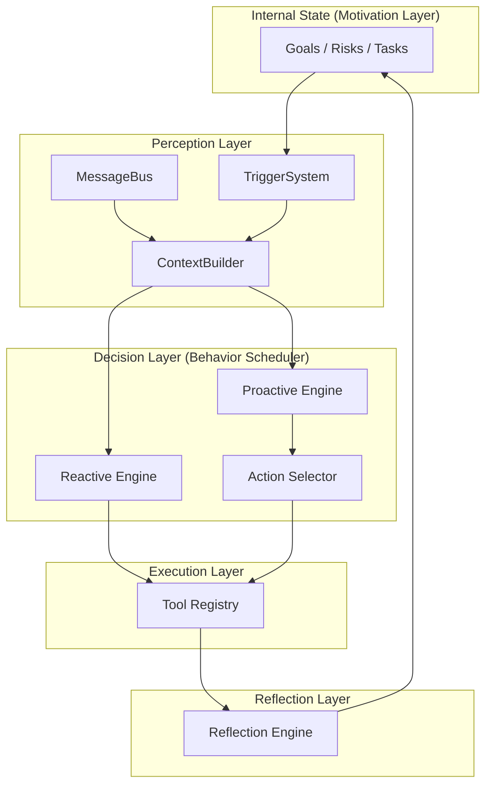

# 🦀 Crabclaw — Your AI Assistant with Human-like Behavior

<p align="center">
  <picture>
    <source media="(prefers-color-scheme: light)" srcset="Crabclaw-logo.jpg">
    
  </picture>
</p>

<p align="center">
  <a href="README.md"><strong>English</strong></a> | <a href="README.zh-CN.md"><strong>中文</strong></a>
</p>

<p align="center">
  <strong>Stop building "chatbots" — start building your AI companion.</strong>
</p>

<p align="center">
  <strong>Two hearts, one brain.</strong>
</p>

<p align="center">
  <a href="https://pypi.org/project/crabclaw-ai/"></a>
  <a href="https://pypi.org/project/crabclaw-ai/"></a>
  <a href="https://discord.gg/MnCvHqpUGB"></a>
  <a href="LICENSE"></a>
  
</p>

> 🧭 **TL;DR:** Crabclaw is not an "LLM wrapper" — it's an Agent OS with "inner drive."

Inspired by [OpenClaw](https://github.com/openclaw/openclaw).

**crabclaw** is an ultra-lightweight, extensible personal AI assistant framework. It's designed around **HABOS (Human-like Agent Behavior Operating System)**: a **dual-engine (Reactive + Proactive)** architecture with **Internal State** that transforms agents from "passive tools" into "goal-driven, boundary-aware, reflective" companions.

⚡️ **Ultra-lightweight**: Core codebase ~**4,000 lines** — readable, hackable, and fast to extend.

## 📢 What's New

- **2026-03-09** 🚀 Beta **v0.0.1** Released

## 🧠 HABOS: Architecture 2.0 (Dual-Engine + Behavior Scheduler)

We've turned "how agents should behave like humans" into runnable software: **dual engines** synchronized by a higher-level **Behavior Scheduler**.

### 1) Core: Two Hearts Beating Together

- **🔵 Reactive Engine**
  - **Role**: Classic ReAct loop
  - **Responsibility**: Handle external inputs (user messages / files), respond quickly, execute tools
- **🔴 Proactive Engine**
  - **Role**: Background autonomous loop
  - **Responsibility**: Driven by internal state (goals / tasks / risks / persona), trigger high-value proactive actions when "value > interruption cost"

### 2) Six-Layer Cognitive Stack: From "Perception" to "Reflection"

crabclaw maps HABOS cognitive flow to clear engineering modules:

1. **Motivation Layer** (Soul): Internal State (goals, tasks, risks, values)
2. **Perception Layer** (Nerves): MessageBus + TriggerSystem (external inputs & internal changes)
3. **Cognitive Layer** (Mind): ContextBuilder (build "current situation")
4. **Decision Layer** (Brain): BehaviorScheduler + ActionSelector (weigh value vs. interruption cost)
5. **Execution Layer** (Hands): ToolRegistry (call tools & external systems)
6. **Reflection Layer** (Conscience): ReflectionEngine (review, calibrate strategy, write back to internal state)



## ✨ Key Features (Why It Feels Like a "Companion")

### 1) Dual-Engine Intelligence: More Than Just Answering

Traditional agents only wake up on input. Crabclaw's **Proactive Engine** runs in the background, observing internal state: when it detects risks, opportunities, or goal deviations, it proactively suggests or reminds you, with an "interruption cost" mechanism to avoid over-bothering.

### 2) Multi-Step Reasoning: Let LLMs Do What They Do Best

Break complex decisions into a chain of "specialized LLM calls" interleaved with deterministic code logic:
- **Judge**: Decide if action is worth taking (value/timeliness/risk/interruption cost)
- **Writer**: Generate the most appropriate expression
- **Editor**: Self-check tone and safety boundaries before sending

### 3) Internal State: Give Your Agent "Inner Drive"

Internal State moves beyond short-context memory to a "long-term awareness" of goals, tasks, risk monitoring, and user persona.

### 4) Reflection Engine: Self-Improvement Loop

The reflection layer evaluates action outcomes: was it valuable? Did it interrupt? Did strategy drift? It then updates internal state to be smarter and more stable next time.

## 📦 Installation

**From Source** (recommended for development, latest features)

```bash
git clone https://github.com/DahaiCAO/crabclaw.git
cd crabclaw
pip install -e .
```

**With [uv](https://github.com/astral-sh/uv)** (stable, extremely fast)

```bash
uv tool install crabclaw-ai
```

**From PyPI** (stable)

```bash
pip install crabclaw-ai
```

## 🚀 Quick Start (Chat in 2 Minutes)

> [!TIP]
> API Keys go in `~/.crabclaw/config.json`.
> Recommended: OpenRouter (global) · Optional: Brave Search (web search)

**1) Initialize**

```bash
crabclaw onboard
```

**2) Configure** (`~/.crabclaw/config.json`)

Merge these into your config (all other fields have defaults):

*Set API Keys (example: OpenRouter):*
```json
{
  "providers": {
    "openrouter": {
      "apiKey": "sk-or-v1-xxx"
    }
  }
}
```

*Set Model (optional: specify provider, otherwise auto-detected):*
```json
{
  "agents": {
    "defaults": {
      "model": "anthropic/claude-opus-4-5",
      "provider": "openrouter"
    }
  }
}
```

**3) Chat**

```bash
crabclaw agent
```

## 💬 Multi-Channel Access (Put Crabclaw Where You Already Chat)

| Channel | What You Need |
|---------|---------------|
| **Telegram** | Bot Token from @BotFather |
| **Discord** | Bot Token + Message Content intent |
| **WhatsApp** | QR code login |
| **Feishu** | App ID + App Secret |
| **Mochat** | Claw token (auto-config supported) |
| **DingTalk** | App Key + App Secret |
| **Slack** | Bot token + App-Level token |
| **Email** | IMAP/SMTP account |
| **QQ** | App ID + App Secret |
| **Matrix** | Homeserver + access token |

### Telegram

1. Create a bot with [@BotFather](https://t.me/BotFather) and get your `token`
2. Add to `~/.crabclaw/config.json`:

```json
{
  "channels": {
    "telegram": {
      "enabled": true,
      "token": "6012345678:AAHtF_...",
      "allowFrom": []  // empty = allow all, non-empty = only listed user IDs
    }
  }
}
```

```bash
crabclaw gateway  # starts Telegram bot
```

### Discord

1. Create a bot at [Discord Developer Portal](https://discord.com/developers/applications)
2. Enable "Message Content Intent" in the bot settings
3. Add to `~/.crabclaw/config.json`:

```json
{
  "channels": {
    "discord": {
      "enabled": true,
      "token": "MTE...",
      "allowFrom": []
    }
  }
}
```

```bash
crabclaw gateway  # starts Discord bot
```

### Matrix

1. Get an access token:
   - Element: Settings → Help & About → Advanced → "Access Token"
   - Synapse: `curl -X POST -d '{
       "type": "m.login.password",
       "identifier": {"type": "m.id.user", "user": "@user:example.org"},
       "password": "your_password",
       "device_id": "crabclaw"
     }' https://matrix.org/_matrix/client/r0/login`

2. Add to `~/.crabclaw/config.json`:

```json
{
  "channels": {
    "matrix": {
      "enabled": true,
      "homeserver": "https://matrix.org",
      "accessToken": "syt_...",
      "userId": "@user:matrix.org",
      "deviceId": "crabclaw"
    }
  }
}
```

### WhatsApp

```bash
crabclaw channels login  # scan QR code
crabclaw gateway        # starts WhatsApp bot
```

> **Note:** Uses [whatsapp-web.js](https://github.com/pedroslopez/whatsapp-web.js) via the TypeScript bridge. The bridge runs automatically when you start the gateway.

### Feishu (Lark)

1. Create an app in [Feishu Developer Console](https://open.feishu.cn/app)
2. Enable "Events" → "Receive messages"
3. Set event callback URL to `http://YOUR_PUBLIC_IP:18790/feishu/events` (or use a tunnel like ngrok)
4. Add to `~/.crabclaw/config.json`:

```json
{
  "channels": {
    "feishu": {
      "enabled": true,
      "appId": "cli_a1b2c3...",
      "appSecret": "A1b2C3...",
      "encryptKey": "",  // optional
      "verificationToken": "",  // optional
      "allowFrom": []
    }
  }
}
```

### Mochat

1. Get your Claw token from [Mochat Console](https://mochat.io/console)
2. Add to `~/.crabclaw/config.json`:

```json
{
  "channels": {
    "mochat": {
      "enabled": true,
      "clawToken": "claw_...",
      "agentUserId": "user_...",  // optional
      "allowFrom": []
    }
  }
}
```

> **Tip:** Use `crabclaw channels login` to auto-configure Mochat via QR code.

### QQ

1. Create a QQ bot at [QQ Developer Platform](https://q.qq.com)
2. Add to `~/.crabclaw/config.json`:

```json
{
  "channels": {
    "qq": {
      "enabled": true,
      "appId": "12345678",
      "secret": "A1b2C3...",
      "allowFrom": []
    }
  }
}
```

### DingTalk

1. Create an app in [DingTalk Developer Console](https://open-dev.dingtalk.com)
2. Enable "Message Callback"
3. Set callback URL to `http://YOUR_PUBLIC_IP:18790/dingtalk/events`
4. Add to `~/.crabclaw/config.json`:

```json
{
  "channels": {
    "dingtalk": {
      "enabled": true,
      "clientId": "dingoa...",
      "clientSecret": "A1b2C3...",
      "allowFrom": []
    }
  }
}
```

### Slack

1. Create a Slack app at [Slack API](https://api.slack.com/apps)
2. Enable "Socket Mode" and "Event Subscriptions"
3. Add scopes: `app_mentions:read`, `chat:write`, `im:history`
4. Add to `~/.crabclaw/config.json`:

```json
{
  "channels": {
    "slack": {
      "enabled": true,
      "mode": "socket",  // or "webhook"
      "botToken": "xoxb-...",
      "appToken": "xapp-...",  // required for socket mode
      "allowFrom": []
    }
  }
}
```

### Email

1. Enable IMAP/SMTP in your email provider settings
2. Add to `~/.crabclaw/config.json`:

```json
{
  "channels": {
    "email": {
      "enabled": true,
      "imapHost": "imap.gmail.com",
      "imapPort": 993,
      "imapUsername": "user@gmail.com",
      "imapPassword": "app-specific-password",
      "smtpHost": "smtp.gmail.com",
      "smtpPort": 587,
      "smtpUsername": "user@gmail.com",
      "smtpPassword": "app-specific-password",
      "fromAddress": "user@gmail.com",
      "allowFrom": []
    }
  }
}
```

## 🎯 Skills (Extensible Capabilities)

crabclaw comes with built-in skills and supports custom skill packages:

| Category | Skills |
|----------|--------|
| **Productivity** | github, weather, tmux, todo, calendar, git |
| **Tools** | web search, execute shell, file operations, curl |
| **Media** | image generation (DALL·E, Midjourney), audio transcription |
| **Fun** | memes, poetry, stories, coding challenges |
| **Security** | password generation, crypto wallet checks |
| **Automation** | tmux session management, project setup, system monitoring |

> **Note:** Some skills require additional API keys (e.g., Brave Search for web search, OpenAI for image generation).

## 🔧 Built-in Tools

### Web Search

Add your Brave Search API key to `~/.crabclaw/config.json`:

```json
{
  "tools": {
    "web": {
      "search": {
        "apiKey": "BSA-...",
        "maxResults": 5
      }
    }
  }
}
```

### Execute Shell

> [!CAUTION]
> Shell execution is powerful. Use `restrictToWorkspace: true` to sandbox the agent.

```json
{
  "tools": {
    "exec": {
      "timeout": 60
    }
  }
}
```

### File Operations

The agent can read, write, edit, and list files in your workspace (or anywhere if `restrictToWorkspace` is false).

### Spawn Sub-Agents

Delegate complex tasks to background sub-agents with their own context and tools:

```python
from crabclaw.agent.subagent import spawn_subagent

async def research_task():
    result = await spawn_subagent(
        task="Research the latest in AI agent architectures",
        context="Focus on HABOS and dual-engine designs",
        tools=["web", "exec", "files"]
    )
    return result
```

## 🌐 Model Providers

crabclaw supports all major LLM providers through LiteLLM. Add your API keys to `~/.crabclaw/config.json`:

| Provider | Key Path | Notes |
|----------|----------|-------|
| **OpenRouter** | `providers.openrouter.apiKey` | Recommended: one key for most models |
| **Anthropic** | `providers.anthropic.apiKey` | Claude direct |
| **OpenAI** | `providers.openai.apiKey` | GPT direct |
| **DeepSeek** | `providers.deepseek.apiKey` | DeepSeek direct |
| **DashScope** | `providers.dashscope.apiKey` | Qwen (Alibaba) |
| **MoonShot** | `providers.moonshot.apiKey` | Kimi |
| **Zhipu** | `providers.zhipu.apiKey` | GLM |
| **Gemini** | `providers.gemini.apiKey` | Google |
| **Groq** | `providers.groq.apiKey` | Fast, includes free Whisper |
| **Volcengine** | `providers.volcengine.apiKey` | Doubao |
| **SiliconFlow** | `providers.siliconflow.apiKey` | Open source models |
| **Minimax** | `providers.minimax.apiKey` | ABAB |
| **Custom** | `providers.custom.apiKey` | Any OpenAI-compatible API |

### Custom Providers

Add custom providers with `ProviderSpec` (no code changes needed):

```python
from crabclaw.providers.spec import ProviderSpec

# Register a custom provider
register_provider(
    ProviderSpec(
        name="myprovider",
        litellm_prefix="myprovider",
        model_keywords=("myprovider", "my-model"),  # model-name keywords for auto-matching
        env_key="MYPROVIDER_API_KEY",        # env var for LiteLLM
        display_name="My Provider",          # shown in `crabclaw status`
        litellm_prefix="myprovider",         # auto-prefix: model -> myprovider/model
        skip_prefixes=("myprovider/",),      # don't double-prefix
    )
)
```

**Step 2.** Add a field to `ProvidersConfig` in `crabclaw/config/schema.py`:

```python
class ProvidersConfig(BaseModel):
    ...
    myprovider: ProviderConfig = ProviderConfig()
```

That's it! Environment variables, model prefixing, config matching, and `crabclaw status` display will all work automatically.

**Common `ProviderSpec` options:**

| Field | Description | Example |
|-------|-------------|---------|
| `litellm_prefix` | Auto-prefix model names for LiteLLM | `"dashscope"` -> `dashscope/qwen-max` |
| `skip_prefixes` | Don't prefix if model already starts with these | `("dashscope/", "openrouter/")` |
| `env_extras` | Additional env vars to set | `(("ZHIPUAI_API_KEY", "{api_key}"),)` |
| `model_overrides` | Per-model parameter overrides | `(("kimi-k2.5", {"temperature": 1.0}),)` |
| `is_gateway` | Can route any model (like OpenRouter) | `True` |
| `detect_by_key_prefix` | Detect gateway by API key prefix | `"sk-or-"` |
| `detect_by_base_keyword` | Detect gateway by API base URL | `"openrouter"` |
| `strip_model_prefix` | Strip existing prefix before re-prefixing | `True` (for AiHubMix) |

</details>


### MCP (Model Context Protocol)

> [!TIP]
> The config format is compatible with Claude Desktop / Cursor. You can copy MCP server configs directly from any MCP server's README.

crabclaw supports [MCP](https://modelcontextprotocol.io/) – connect external tool servers and use them as native agent tools.

Add MCP servers to your `config.json`:

```json
{
  "tools": {
    "mcpServers": {
      "filesystem": {
        "command": "npx",
        "args": ["-y", "@modelcontextprotocol/server-filesystem", "/path/to/dir"]
      },
      "my-remote-mcp": {
        "url": "https://example.com/mcp/",
        "headers": {
          "Authorization": "Bearer xxxxx"
        }
      }
    }
  }
}
```

Two transport modes are supported:

| Mode | Config | Example |
|------|--------|---------|
| **Stdio** | `command` + `args` | Local process via `npx` / `uvx` |
| **HTTP** | `url` + `headers` (optional) | Remote endpoint (`https://mcp.example.com/sse`) |

Use `toolTimeout` to override the default 30s per-call timeout for slow servers:

```json
{
  "tools": {
    "mcpServers": {
      "my-slow-server": {
        "url": "https://example.com/mcp/",
        "toolTimeout": 120
      }
    }
  }
}
```

MCP tools are automatically discovered and registered on startup. The LLM can use them alongside built-in tools – no extra configuration needed.


### Security

> [!TIP]
> For production deployments, set `"restrictToWorkspace": true` in your config to sandbox the agent.
> **Change in source / post-`v0.1.4.post3`:** In `v0.1.4.post3` and earlier, an empty `allowFrom` means "allow all senders". In newer versions (including building from source), **empty `allowFrom` denies all access by default**. To 
allow all senders, set `"allowFrom": ["*"]`.

| Option | Default | Description |
|--------|---------|-------------|
| `tools.restrictToWorkspace` | `false` | When `true`, restricts **all** agent tools (shell, file read/write/edit, list) to the workspace directory. Prevents path traversal and out-of-scope access. |
| `tools.exec.pathAppend` | `""` | Extra directories to append to `PATH` when running shell commands (e.g. `/usr/sbin` for `ufw`). |
| `channels.*.allowFrom` | `[]` (allow all) | Whitelist of user IDs. Empty = allow everyone; non-empty = only listed users can interact. |


## CLI Reference

| Command | Description |
|---------|-------------|
| `crabclaw onboard` | Initialize config & workspace |
| `crabclaw agent -m "..."` | Chat with the agent |
| `crabclaw agent` | Interactive chat mode |
| `crabclaw agent --no-markdown` | Show plain-text replies |
| `crabclaw agent --logs` | Show runtime logs during chat |
| `crabclaw gateway` | Start the gateway |
| `crabclaw status` | Show status |
| `crabclaw provider login openai-codex` | OAuth login for providers |
| `crabclaw channels login` | Link WhatsApp (scan QR) |
| `crabclaw channels status` | Show channel status |

Interactive mode exits: `exit`, `quit`, `/exit`, `/quit`, `:q`, or `Ctrl+D`.

<details>
<summary><b>Heartbeat (Periodic Tasks)</b></summary>

The gateway wakes up every 30 minutes and checks `HEARTBEAT.md` in your workspace (`~/.crabclaw/workspace/HEARTBEAT.md`). If the file has tasks, the agent executes them and delivers results to your most recently active chat channel.
**Setup:** edit `~/.crabclaw/workspace/HEARTBEAT.md` (created automatically by `crabclaw onboard`):

```markdown
## Periodic Tasks

- [ ] Check weather forecast and send a summary
- [ ] Scan inbox for urgent emails
```

The agent can also manage this file itself – ask it to "add a periodic task" and it will update `HEARTBEAT.md` for you.

> **Note:** The gateway must be running (`crabclaw gateway`) and you must have chatted with the bot at least once so it knows which channel to deliver to.

</details>

## 🐳 Docker

> [!TIP]
> The `-v ~/.crabclaw:/root/.crabclaw` flag mounts your local config directory into the container, so your config and workspace persist across container restarts.

### Docker Compose

```bash
docker compose run --rm crabclaw-cli onboard   # first-time setup
vim ~/.crabclaw/config.json                     # add API keys
docker compose up -d crabclaw-gateway           # start gateway
```

```bash
docker compose run --rm crabclaw-cli agent -m "Hello!"   # run CLI
docker compose logs -f crabclaw-gateway                   # view logs
docker compose down                                      # stop
```

### Docker

```bash
# Build the image
docker build -t crabclaw .

# Initialize config (first time only)
docker run -v ~/.crabclaw:/root/.crabclaw --rm crabclaw onboard

# Edit config on host to add API keys
vim ~/.crabclaw/config.json

# Run gateway (connects to enabled channels, e.g. Telegram/Discord/Mochat)
docker run -v ~/.crabclaw:/root/.crabclaw -p 18790:18790 crabclaw gateway

# Or run a single command
docker run -v ~/.crabclaw:/root/.crabclaw --rm crabclaw agent -m "Hello!"
docker run -v ~/.crabclaw:/root/.crabclaw --rm crabclaw status
```

## 🐧 Linux Service

Run the gateway as a systemd user service so it starts automatically and restarts on failure.

**1. Find the crabclaw binary path:**

```bash
which crabclaw   # e.g. /home/user/.local/bin/crabclaw
```

**2. Create the service file** at `~/.config/systemd/user/crabclaw-gateway.service` (replace `ExecStart` path if needed):

```ini
[Unit]
Description=crabclaw Gateway
After=network.target

[Service]
Type=simple
ExecStart=%h/.local/bin/crabclaw gateway
Restart=always
RestartSec=10
NoNewPrivileges=yes
ProtectSystem=strict
ReadWritePaths=%h

[Install]
WantedBy=default.target
```

**3. Enable and start:**

```bash
systemctl --user daemon-reload
systemctl --user enable --now crabclaw-gateway
```

**Common operations:**

```bash
systemctl --user status crabclaw-gateway        # check status
systemctl --user restart crabclaw-gateway       # restart after config changes
journalctl --user -u crabclaw-gateway -f        # follow logs
```

If you edit the `.service` file itself, run `systemctl --user daemon-reload` before restarting.

> **Note:** User services only run while you are logged in. To keep the gateway running after logout, enable lingering:
> 
> ```bash
> loginctl enable-linger $USER
> ```

## 📁 Project Structure

```
crabclaw/
├── agent/          # 🧠 Core agent logic
│   ├── loop.py     #    Agent loop (LLM + tool execution)
│   ├── context.py  #    Prompt builder
│   ├── memory.py   #    Persistent memory
│   ├── skills.py   #    Skills loader
│   ├── subagent.py #    Background task execution
│   └── tools/      #    Built-in tools (incl. spawn)
├── skills/         # 🎯 Bundled skills (github, weather, tmux...)
├── channels/       # 📱 Chat channel integrations
├── bus/            # 🚌 Message routing
├── cron/           # ⏰ Scheduled tasks
├── heartbeat/      # 💓 Proactive wake-up
├── providers/      # 🤖 LLM providers (OpenRouter, etc.) + transcription
├── session/        # 💬 Conversation sessions
├── config/         # ⚙️ Configuration
├── proactive/      # 🔴 Proactive engine (engine, selector, state, triggers)
├── reflection/     # 🪞 Reflection engine (evaluate & log)
├── prompts/        # 🧾 Prompt manager & defaults
├── i18n/           # 🌐 Localization
├── templates/      # 📄 Workspace templates (HEARTBEAT, SOUL, TOOLS)
├── utils/          # 🔧 Utilities (logging, http_pool, metrics, plugins)
├── dashboard/      # 📊 Minimal dashboard (static web, broadcaster)
└── cli/            # 🖥️ Commands
```

```
Top-level
├── bridge/         # 🌉 TypeScript bridge (WhatsApp, server)
├── dashboard/      # 📊 Dashboard service (Python)
└── tests/          # ✅ Unit tests
```

## 🤝 Contribute & Roadmap

PRs welcome! The codebase is intentionally small and readable. 🤗

**Roadmap** – Pick an item and [open a PR](https://github.com/DahaiCAO/crabclaw/pulls)!

- [ ] **Multi-modal** – See and hear (images, voice, video)
- [ ] **Long-term memory** – Never forget important context
- [ ] **Better reasoning** – Multi-step planning and reflection
- [ ] **More integrations** – Calendar and more
- [ ] **Self-improvement** – Learn from feedback and mistakes

### Contributors

<a href="https://github.com/DahaiCAO/crabclaw/graphs/contributors">
  
</a>