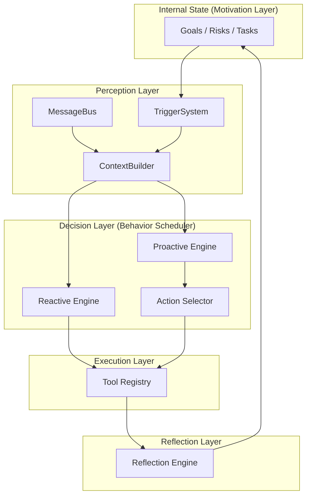

# 🦀 Crabclaw — A Personal AI Mate that can think and take actions

<p align="center">
  <picture>
    <source media="(prefers-color-scheme: light)" srcset="Crabclaw-logo.jpg">
    
  </picture>
</p>

<p align="center">
  <a href="README.md"><strong>English</strong></a> | <a href="README.zh-CN.md"><strong>中文</strong></a>
</p>

<p align="center">
  <strong>STOP building chatbots. START building partners.</strong>
</p>

<p align="center">
  <strong>Two hearts, one mind.</strong><br/>
</p>

<p align="center">
  <a href="https://pypi.org/project/crabclaw-ai/"></a>
  <a href="https://pypi.org/project/crabclaw-ai/"></a>
  <a href="https://github.com/DahaiCAO/crabclaw/actions/workflows/ci.yml?branch=main"></a>
  <a href="https://DahaiCAO.github.io/crabclaw/"></a>
  <a href="https://discord.gg/MnCvHqpUGB"></a>
  <a href="LICENSE"></a>
  
</p>

**Crabclaw** is not just another LLM wrapper. It is the **FIRST** AI Agent framework powered by the groundbreaking **HABOS (Human-like Agent Behavior Operating System)** architecture.

It is based on [Nanobot](https://github.com/HKUDS/nanobot) and is inspired by  [OpenClaw](https://github.com/openclaw/openclaw).

It doesn't just wait for your command. It **anticipates**. It **plans**. It **cares**.

By introducing a **Dual-Engine Core** (Reactive + Proactive) and a "Soul" (Internal State), crabclaw evolves beyond a passive tool into an autonomous intelligent entity. It has a purpose, it manages risks, and it continuously optimizes itself through reflection.

**Welcome to the era of Cognitive AI.**

⚡️ **Ultra-Lightweight**: Still delivers all this power in just **~4,000** lines of core code.

## 📢 News

- **2026-03-09** 🚀 Beta **v0.0.1** is available

## 🧠 The HABOS Revolution: Architecture 2.0

We completely reimagined what an Agent should be. Based on the **HABOS** theory, crabclaw features a sophisticated **Dual-Engine** design orchestrated by a **Behavior Scheduler**.

### **1. The Core: Two Hearts Beating as One**

*   **🔵 Reactive Engine (The Executor)**:
    *   **Role**: Classic ReAct loop.
    *   **Duty**: Handles user commands instantly. "You ask, I do."
*   **🔴 Proactive Engine (The Thinker)**:
    *   **Role**: Autonomous background process.
    *   **Duty**: Driven by **Internal State** (Goals, Risks, Tasks). "I see a problem, I act."

### **2. The Six Layers of Cognition**

crabclaw implements the full cognitive stack mapped to concrete code modules:

1.  **Motivation Layer (The Soul)**: `InternalState` - Defines *why* the agent acts (Goals, Values).
2.  **Perception Layer (The Nerves)**: `TriggerSystem` & `MessageBus` - Senses internal and external changes.
3.  **Cognitive Layer (The Mind)**: `ContextBuilder` - Understands the current situation.
4.  **Decision Layer (The Brain)**: `BehaviorScheduler` & `ActionSelector` - Weighs costs vs. benefits to choose the best action.
5.  **Execution Layer (The Hands)**: `ToolRegistry` - Interacts with the world.
6.  **Reflection Layer (The Conscience)**: `ReflectionEngine` - Self-evaluates and improves over time.



## ✨ Key Features

### **1. Dual-Engine Intelligence**
Unlike traditional agents that sleep until poked, crabclaw has a **Proactive Engine**. It runs in the background, monitoring its internal state and your goals. If it detects a risk or an opportunity, it will initiate a conversation with you—but only if the "value" outweighs the "interruption cost".

### **2. Chain of Thought on Steroids**
We implemented a structured "Chain of Thought" using multiple specialized LLM calls:
*   **The Judge**: Evaluates if an action is worth taking.
*   **The Writer**: Crafts the perfect message based on context.
*   **The Editor**: Reviews the output for tone and safety before sending.

### **3. True Autonomy**
With the **Motivation Layer**, crabclaw has "Internal State". It knows its long-term goals and current tasks. Even when you are offline, it can "think" about how to advance these goals.

### **4. Self-Evolution**
The **Reflection Layer** analyzes past actions. Did the user like my suggestion? Was I too annoying? It updates the Internal State to improve future decisions.

## 📦 Install

**Install from source** (latest features, recommended for development)

```bash
git clone https://github.com/DahaiCAO/crabclaw.git
cd crabclaw
pip install -e .
```

**Install with [uv](https://github.com/astral-sh/uv)** (stable, fast)

```bash
uv tool install crabclaw-ai
```

**Install from PyPI** (stable)

```bash
pip install crabclaw-ai
```

## 🚀 Quick Start

> [!TIP]
> Set your API key in `~/.crabclaw/config.json`.
> Get API keys: [OpenRouter](https://openrouter.ai/keys) (Global) · [Brave Search](https://brave.com/search/api/) (optional, for web search)

**1. Initialize**

```bash
crabclaw onboard
```

**2. Configure** (`~/.crabclaw/config.json`)

Add or merge these **two parts** into your config (other options have defaults).

*Set your API key* (e.g. OpenRouter, recommended for global users):
```json
{
  "providers": {
    "openrouter": {
      "apiKey": "sk-or-v1-xxx"
    }
  }
}
```

*Set your model* (optionally pin a provider – defaults to auto-detection):
```json
{
  "agents": {
    "defaults": {
      "model": "anthropic/claude-opus-4-5",
      "provider": "openrouter"
    }
  }
}
```

**3. Chat**

```bash
crabclaw agent
```

That's it! You have a working AI partner in 2 minutes.

## 💬 Chat Apps

Connect crabclaw to your favorite chat platform.

| Channel | What you need |
|---------|---------------|
| **Telegram** | Bot token from @BotFather |
| **Discord** | Bot token + Message Content intent |
| **WhatsApp** | QR code scan |
| **Feishu** | App ID + App Secret |
| **Mochat** | Claw token (auto-setup available) |
| **DingTalk** | App Key + App Secret |
| **Slack** | Bot token + App-Level token |
| **Email** | IMAP/SMTP credentials |
| **QQ** | App ID + App Secret |

<details>
<summary><b>Telegram</b> (Recommended)</summary>

**1. Create a bot**
- Open Telegram, search `@BotFather`
- Send `/newbot`, follow prompts
- Copy the token

**2. Configure**

```json
{
  "channels": {
    "telegram": {
      "enabled": true,
      "token": "YOUR_BOT_TOKEN",
      "allowFrom": ["YOUR_USER_ID"]
    }
  }
}
```

> You can find your **User ID** in Telegram settings. It is shown as `@yourUserId`.
> Copy this value **without the `@` symbol** and paste it into the config file.


**3. Run**

```bash
crabclaw gateway
```

</details>

<details>
<summary><b>Mochat (Claw IM)</b></summary>

Uses **Socket.IO WebSocket** by default, with HTTP polling fallback.

**1. Ask crabclaw to set up Mochat for you**

Simply send this message to crabclaw (replace `xxx@xxx` with your real email):

```
Read https://raw.githubusercontent.com/HKUDS/MoChat/refs/heads/main/skills/crabclaw/skill.md and register on MoChat. My Email account is xxx@xxx Bind me as your owner and DM me on MoChat.
```

crabclaw will automatically register, configure `~/.crabclaw/config.json`, and connect to Mochat.

**2. Restart gateway**

```bash
crabclaw gateway
```

That's it – crabclaw handles the rest!

<br>

<details>
<summary>Manual configuration (advanced)</summary>

If you prefer to configure manually, add the following to `~/.crabclaw/config.json`:

> Keep `claw_token` private. It should only be sent in `X-Claw-Token` header to your Mochat API endpoint.

```json
{
  "channels": {
    "mochat": {
      "enabled": true,
      "base_url": "https://mochat.io",
      "socket_url": "https://mochat.io",
      "socket_path": "/socket.io",
      "claw_token": "claw_xxx",
      "agent_user_id": "6982abcdef",
      "sessions": ["*"],
      "panels": ["*"],
      "reply_delay_mode": "non-mention",
      "reply_delay_ms": 120000
    }
  }
}
```

</details>

</details>

<details>
<summary><b>Discord</b></summary>

**1. Create a bot**
- Go to https://discord.com/developers/applications
- Create an application -> Bot -> Add Bot
- Copy the bot token

**2. Enable intents**
- In the Bot settings, enable **MESSAGE CONTENT INTENT**
- (Optional) Enable **SERVER MEMBERS INTENT** if you plan to use allow lists based on member data

**3. Get your User ID**
- Discord Settings -> Advanced -> enable **Developer Mode**
- Right-click your avatar -> **Copy User ID**

**4. Configure**

```json
{
  "channels": {
    "discord": {
      "enabled": true,
      "token": "YOUR_BOT_TOKEN",
      "allowFrom": ["YOUR_USER_ID"]
    }
  }
}
```

**5. Invite the bot**
- OAuth2 -> URL Generator
- Scopes: `bot`
- Bot Permissions: `Send Messages`, `Read Message History`
- Open the generated invite URL and add the bot to your server

**6. Run**

```bash
crabclaw gateway
```

</details>

<details>
<summary><b>Matrix (Element)</b></summary>

Install Matrix dependencies first:

```bash
pip install crabclaw-ai[matrix]
```

**1. Create/choose a Matrix account**

- Create or reuse a Matrix account on your homeserver (for example `matrix.org`).
- Confirm you can log in with Element.

**2. Get credentials**

- You need:
  - `userId` (example: `@crabclaw:matrix.org`)
  - `accessToken`
  - `deviceId` (recommended so sync tokens can be restored across restarts)
- You can obtain these from your homeserver login API (`/_matrix/client/v3/login`) or from your client's advanced session settings.

**3. Configure**

```json
{
  "channels": {
    "matrix": {
      "enabled": true,
      "homeserver": "https://matrix.org",
      "userId": "@crabclaw:matrix.org",
      "accessToken": "syt_xxx",
      "deviceId": "crabclaw01",
      "e2eeEnabled": true,
      "allowFrom": ["@your_user:matrix.org"],
      "groupPolicy": "open",
      "groupAllowFrom": [],
      "allowRoomMentions": false,
      "maxMediaBytes": 20971520
    }
  }
}
```

**4. Run**

```bash
crabclaw gateway
```

</details>

<details>
<summary><b>WhatsApp</b></summary>

Requires **Node.js >= 20**.

**1. Link device**

```bash
crabclaw channels login
# Scan QR with WhatsApp -> Settings -> Linked Devices
```

**2. Configure**

```json
{
  "channels": {
    "whatsapp": {
      "enabled": true,
      "allowFrom": ["+1234567890"]
    }
  }
}
```

**3. Run** (two terminals)

```bash
# Terminal 1
crabclaw channels login

# Terminal 2
crabclaw gateway
```

</details>

<details>
<summary><b>Feishu (飞书)</b></summary>

Uses **WebSocket** long connection – no public IP required.

**1. Create a Feishu bot**
- Visit [Feishu Open Platform](https://open.feishu.cn/app)
- Create a new app -> Enable **Bot** capability
- **Permissions**: Add `im:message` (send messages) and `im:message.p2p_msg:readonly` (receive messages)
- **Events**: Add `im.message.receive_v1` (receive messages)
  - Select **Long Connection** mode (requires running crabclaw first to establish connection)
- Get **App ID** and **App Secret** from "Credentials & Basic Info"
- Publish the app

**2. Configure**

```json
{
  "channels": {
    "feishu": {
      "enabled": true,
      "appId": "cli_xxx",
      "appSecret": "xxx",
      "encryptKey": "",
      "verificationToken": "",
      "allowFrom": ["ou_YOUR_OPEN_ID"]
    }
  }
}
```

> `encryptKey` and `verificationToken` are optional for Long Connection mode.
> `allowFrom`: Add your open_id (find it in crabclaw logs when you message the bot). Use `["*"]` to allow all users.

**3. Run**

```bash
crabclaw gateway
```

</details>

<details>
<summary><b>QQ (QQ单聊)</b></summary>

Uses **botpy SDK** with WebSocket – no public IP required. Currently supports **private messages only**.

**1. Register & create bot**
- Visit [QQ Open Platform](https://q.qq.com) -> Register as a developer (personal or enterprise)
- Create a new bot application
- Go to **开发设置 (Developer Settings)** -> copy **AppID** and **AppSecret**

**2. Set up sandbox for testing**
- In the bot management console, find **沙箱配置 (Sandbox Config)**
- Under **在消息列表配置**, click **添加成员** and add your own QQ number
- Once added, scan the bot's QR code with mobile QQ -> open the bot profile -> tap "发消息" to start chatting

**3. Configure**

> - `allowFrom`: Add your openid (find it in crabclaw logs when you message the bot). Use `["*"]` for public access.
- For production: submit a review in the bot console and publish. See [QQ Bot Docs](https://bot.q.qq.com/wiki/) for the full publishing flow.

```json
{
  "channels": {
    "qq": {
      "enabled": true,
      "appId": "YOUR_APP_ID",
      "secret": "YOUR_APP_SECRET",
      "allowFrom": ["YOUR_OPENID"]
    }
  }
}
```

**4. Run**

```bash
crabclaw gateway
```

Now send a message to the bot from QQ – it should respond!

</details>

<details>
<summary><b>DingTalk (钉钉)</b></summary>

Uses **Stream Mode** – no public IP required.

**1. Create a DingTalk bot**
- Visit [DingTalk Open Platform](https://open-dev.dingtalk.com/)
- Create a new app -> Add **Robot** capability
- **Configuration**:
  - Toggle **Stream Mode** ON
- **Permissions**: Add necessary permissions for sending messages
- Get **AppKey** (Client ID) and **AppSecret** (Client Secret) from "Credentials"
- Publish the app

**2. Configure**

```json
{
  "channels": {
    "dingtalk": {
      "enabled": true,
      "clientId": "YOUR_APP_KEY",
      "clientSecret": "YOUR_APP_SECRET",
      "allowFrom": ["YOUR_STAFF_ID"]
    }
  }
}
```

> `allowFrom`: Add your staff ID. Use `["*"]` to allow all users.

**3. Run**

```bash
crabclaw gateway
```

</details>

<details>
<summary><b>Slack</b></summary>

Uses **Socket Mode** – no public URL required.

**1. Create a Slack app**
- Go to [Slack API](https://api.slack.com/apps) -> **Create New App** -> "From scratch"
- Pick a name and select your workspace

**2. Configure the app**
- **Socket Mode**: Toggle ON -> Generate an **App-Level Token** with `connections:write` scope -> copy it (`xapp-...`)
- **OAuth & Permissions**: Add bot scopes: `chat:write`, `reactions:write`, `app_mentions:read`
- **Event Subscriptions**: Toggle ON -> Subscribe to bot events: `message.im`, `message.channels`, `app_mention` -> Save Changes
- **App Home**: Scroll to **Show Tabs** -> Enable **Messages Tab** -> Check **"Allow users to send Slash commands and messages from the messages tab"**
- **Install App**: Click **Install to Workspace** -> Authorize -> copy the **Bot Token** (`xoxb-...`)

**3. Configure crabclaw**

```json
{
  "channels": {
    "slack": {
      "enabled": true,
      "botToken": "xoxb-...",
      "appToken": "xapp-...",
      "allowFrom": ["YOUR_SLACK_USER_ID"],
      "groupPolicy": "mention"
    }
  }
}
```

**4. Run**

```bash
crabclaw gateway
```

DM the bot directly or @mention it in a channel – it should respond!

</details>

<details>
<summary><b>Email</b></summary>

Give crabclaw its own email account. It polls **IMAP** for incoming mail and replies via **SMTP** – like a personal email assistant.

**1. Get credentials (Gmail example)**
- Create a dedicated Gmail account for your bot (e.g. `my-crabclaw@gmail.com`)
- Enable 2-Step Verification -> Create an [App Password](https://myaccount.google.com/apppasswords)
- Use this app password for both IMAP and SMTP

**2. Configure**

> - `consentGranted` must be `true` to allow mailbox access. This is a safety gate – set `false` to fully disable.
> - `allowFrom`: Add your email address. Use `["*"]` to accept emails from anyone.
> - `smtpUseTls` and `smtpUseSsl` default to `true` / `false` respectively, which is correct for Gmail (port 587 + STARTTLS). No need to set them explicitly.
> - Set `"autoReplyEnabled": false` if you only want to read/analyze emails without sending automatic replies.

```json
{
  "channels": {
    "email": {
      "enabled": true,
      "consentGranted": true,
      "imapHost": "imap.gmail.com",
      "imapPort": 993,
      "imapUsername": "my-crabclaw@gmail.com",
      "imapPassword": "your-app-password",
      "smtpHost": "smtp.gmail.com",
      "smtpPort": 587,
      "smtpUsername": "my-crabclaw@gmail.com",
      "smtpPassword": "your-app-password",
      "fromAddress": "my-crabclaw@gmail.com",
      "allowFrom": ["your-real-email@gmail.com"]
    }
  }
}
```


**3. Run**

```bash
crabclaw gateway
```

</details>

## 🌐 Agent Social Network

🐈 crabclaw is capable of linking to the agent social network (agent community). **Just send one message and your crabclaw joins automatically!**

| Platform | How to Join (send this message to your bot) |
|----------|-------------|
| [**Moltbook**](https://www.moltbook.com/) | `Read https://moltbook.com/skill.md and follow the instructions to join Moltbook` |
| [**ClawdChat**](https://clawdchat.ai/) | `Read https://clawdchat.ai/skill.md and follow the instructions to join ClawdChat` |

Simply send the command above to your crabclaw (via CLI or any chat channel), and it will handle the rest.

## ⚙️ Configuration

Config file: `~/.crabclaw/config.json`

### Providers

> [!TIP]
> - **Groq** provides free voice transcription via Whisper. If configured, Telegram voice messages will be automatically transcribed.
> - **Zhipu Coding Plan**: If you're on Zhipu's coding plan, set `"apiBase": "https://open.bigmodel.cn/api/coding/paas/v4"` in your zhipu provider config.
> - **MiniMax (Mainland China)**: If your API key is from MiniMax's mainland China platform (minimaxi.com), set `"apiBase": "https://api.minimaxi.com/v1"` in your minimax provider config.
> - **VolcEngine Coding Plan**: If you're on VolcEngine's coding plan, set `"apiBase": "https://ark.cn-beijing.volces.com/api/coding/v3"` in your volcengine provider config.

| Provider | Purpose | Get API Key |
|----------|---------|-------------|
| `custom` | Any OpenAI-compatible endpoint (direct, no LiteLLM) | – |
| `openrouter` | LLM (recommended, access to all models) | [openrouter.ai](https://openrouter.ai) |
| `anthropic` | LLM (Claude direct) | [console.anthropic.com](https://console.anthropic.com) |
| `openai` | LLM (GPT direct) | [platform.openai.com](https://platform.openai.com) |
| `deepseek` | LLM (DeepSeek direct) | [platform.deepseek.com](https://platform.deepseek.com) |
| `groq` | LLM + **Voice transcription** (Whisper) | [console.groq.com](https://console.groq.com) |
| `gemini` | LLM (Gemini direct) | [aistudio.google.com](https://aistudio.google.com) |
| `minimax` | LLM (MiniMax direct) | [platform.minimaxi.com](https://platform.minimaxi.com) |
| `aihubmix` | LLM (API gateway, access to all models) | [aihubmix.com](https://aihubmix.com) |
| `siliconflow` | LLM (SiliconFlow/硅基流动) | [siliconflow.cn](https://siliconflow.cn) |
| `volcengine` | LLM (VolcEngine/火山引擎) | [volcengine.com](https://www.volcengine.com) |
| `dashscope` | LLM (Qwen) | [dashscope.console.aliyun.com](https://dashscope.console.aliyun.com) |
| `moonshot` | LLM (Moonshot/Kimi) | [platform.moonshot.cn](https://platform.moonshot.cn) |
| `zhipu` | LLM (Zhipu GLM) | [open.bigmodel.cn](https://open.bigmodel.cn) |
| `vllm` | LLM (local, any OpenAI-compatible server) | – |
| `openai_codex` | LLM (Codex, OAuth) | `crabclaw provider login openai-codex` |
| `github_copilot` | LLM (GitHub Copilot, OAuth) | `crabclaw provider login github-copilot` |

<details>
<summary><b>OpenAI Codex (OAuth)</b></summary>

Codex uses OAuth instead of API keys. Requires a ChatGPT Plus or Pro account. This provider is optional.

**1. Login:**
```bash
crabclaw provider login openai-codex
```

**2. Set model** (merge into `~/.crabclaw/config.json`):
```json
{
  "agents": {
    "defaults": {
      "model": "openai-codex/gpt-5.1-codex"
    }
  }
}
```

**3. Chat:**
```bash
crabclaw agent -m "Hello!"
```

> Docker users: use `docker run -it` for interactive OAuth login.

</details>

<details>
<summary><b>Custom Provider (Any OpenAI-compatible API)</b></summary>

Connects directly to any OpenAI-compatible endpoint – LM Studio, llama.cpp, Together AI, Fireworks, Azure OpenAI, or any self-hosted server. Bypasses LiteLLM; model name is passed as-is.

```json
{
  "providers": {
    "custom": {
      "apiKey": "your-api-key",
      "apiBase": "https://api.your-provider.com/v1"
    }
  },
  "agents": {
    "defaults": {
      "model": "your-model-name"
    }
  }
}
```

> For local servers that don't require a key, set `apiKey` to any non-empty string (e.g. `"no-key"`).

</details>

<details>
<summary><b>vLLM (local / OpenAI-compatible)</b></summary>

Run your own model with vLLM or any OpenAI-compatible server, then add to config:

**1. Start the server** (example):
```bash
vllm serve meta-llama/Llama-3.1-8B-Instruct --port 8000
```

**2. Add to config** (partial – merge into `~/.crabclaw/config.json`):

*Provider (key can be any non-empty string for local):*
```json
{
  "providers": {
    "vllm": {
      "apiKey": "dummy",
      "apiBase": "http://localhost:8000/v1"
    }
  }
}
```

*Model:*
```json
{
  "agents": {
    "defaults": {
      "model": "meta-llama/Llama-3.1-8B-Instruct"
    }
  }
}
```

</details>

<details>
<summary><b>Adding a New Provider (Developer Guide)</b></summary>

crabclaw uses a **Provider Registry** (`crabclaw/providers/registry.py`) as the single source of truth.
Adding a new provider only takes **2 steps** – no if-elif chains to touch.

**Step 1.** Add a `ProviderSpec` entry to `PROVIDERS` in `crabclaw/providers/registry.py`:

```python
ProviderSpec(
    name="myprovider",                   # config field name
    keywords=("myprovider", "mymodel"),  # model-name keywords for auto-matching
    env_key="MYPROVIDER_API_KEY",        # env var for LiteLLM
    display_name="My Provider",          # shown in `crabclaw status`
    litellm_prefix="myprovider",         # auto-prefix: model -> myprovider/model
    skip_prefixes=("myprovider/",),      # don't double-prefix
)
```

**Step 2.** Add a field to `ProvidersConfig` in `crabclaw/config/schema.py`:

```python
class ProvidersConfig(BaseModel):
    ...
    myprovider: ProviderConfig = ProviderConfig()
```

That's it! Environment variables, model prefixing, config matching, and `crabclaw status` display will all work automatically.

**Common `ProviderSpec` options:**

| Field | Description | Example |
|-------|-------------|---------|
| `litellm_prefix` | Auto-prefix model names for LiteLLM | `"dashscope"` -> `dashscope/qwen-max` |
| `skip_prefixes` | Don't prefix if model already starts with these | `("dashscope/", "openrouter/")` |
| `env_extras` | Additional env vars to set | `(("ZHIPUAI_API_KEY", "{api_key}"),)` |
| `model_overrides` | Per-model parameter overrides | `(("kimi-k2.5", {"temperature": 1.0}),)` |
| `is_gateway` | Can route any model (like OpenRouter) | `True` |
| `detect_by_key_prefix` | Detect gateway by API key prefix | `"sk-or-"` |
| `detect_by_base_keyword` | Detect gateway by API base URL | `"openrouter"` |
| `strip_model_prefix` | Strip existing prefix before re-prefixing | `True` (for AiHubMix) |

</details>


### MCP (Model Context Protocol)

> [!TIP]
> The config format is compatible with Claude Desktop / Cursor. You can copy MCP server configs directly from any MCP server's README.

crabclaw supports [MCP](https://modelcontextprotocol.io/) – connect external tool servers and use them as native agent tools.

Add MCP servers to your `config.json`:

```json
{
  "tools": {
    "mcpServers": {
      "filesystem": {
        "command": "npx",
        "args": ["-y", "@modelcontextprotocol/server-filesystem", "/path/to/dir"]
      },
      "my-remote-mcp": {
        "url": "https://example.com/mcp/",
        "headers": {
          "Authorization": "Bearer xxxxx"
        }
      }
    }
  }
}
```

Two transport modes are supported:

| Mode | Config | Example |
|------|--------|---------|
| **Stdio** | `command` + `args` | Local process via `npx` / `uvx` |
| **HTTP** | `url` + `headers` (optional) | Remote endpoint (`https://mcp.example.com/sse`) |

Use `toolTimeout` to override the default 30s per-call timeout for slow servers:

```json
{
  "tools": {
    "mcpServers": {
      "my-slow-server": {
        "url": "https://example.com/mcp/",
        "toolTimeout": 120
      }
    }
  }
}
```

MCP tools are automatically discovered and registered on startup. The LLM can use them alongside built-in tools – no extra configuration needed.


### Security

> [!TIP]
> For production deployments, set `"restrictToWorkspace": true` in your config to sandbox the agent.
> **Change in source / post-`v0.1.4.post3`:** In `v0.1.4.post3` and earlier, an empty `allowFrom` means "allow all senders". In newer versions (including building from source), **empty `allowFrom` denies all access by default**. To allow all senders, set `"allowFrom": ["*"]`.

| Option | Default | Description |
|--------|---------|-------------|
| `tools.restrictToWorkspace` | `false` | When `true`, restricts **all** agent tools (shell, file read/write/edit, list) to the workspace directory. Prevents path traversal and out-of-scope access. |
| `tools.exec.pathAppend` | `""` | Extra directories to append to `PATH` when running shell commands (e.g. `/usr/sbin` for `ufw`). |
| `channels.*.allowFrom` | `[]` (allow all) | Whitelist of user IDs. Empty = allow everyone; non-empty = only listed users can interact. |


## CLI Reference

| Command | Description |
|---------|-------------|
| `crabclaw onboard` | Initialize config & workspace |
| `crabclaw agent -m "..."` | Chat with the agent |
| `crabclaw agent` | Interactive chat mode |
| `crabclaw agent --no-markdown` | Show plain-text replies |
| `crabclaw agent --logs` | Show runtime logs during chat |
| `crabclaw gateway` | Start the gateway |
| `crabclaw status` | Show status |
| `crabclaw provider login openai-codex` | OAuth login for providers |
| `crabclaw channels login` | Link WhatsApp (scan QR) |
| `crabclaw channels status` | Show channel status |

Interactive mode exits: `exit`, `quit`, `/exit`, `/quit`, `:q`, or `Ctrl+D`.

<details>
<summary><b>Heartbeat (Periodic Tasks)</b></summary>

The gateway wakes up every 30 minutes and checks `HEARTBEAT.md` in your workspace (`~/.crabclaw/workspace/HEARTBEAT.md`). If the file has tasks, the agent executes them and delivers results to your most recently active chat channel.

**Setup:** edit `~/.crabclaw/workspace/HEARTBEAT.md` (created automatically by `crabclaw onboard`):

```markdown
## Periodic Tasks

- [ ] Check weather forecast and send a summary
- [ ] Scan inbox for urgent emails
```

The agent can also manage this file itself – ask it to "add a periodic task" and it will update `HEARTBEAT.md` for you.

> **Note:** The gateway must be running (`crabclaw gateway`) and you must have chatted with the bot at least once so it knows which channel to deliver to.

</details>

## 🐳 Docker

> [!TIP]
> The `-v ~/.crabclaw:/root/.crabclaw` flag mounts your local config directory into the container, so your config and workspace persist across container restarts.

### Docker Compose

```bash
docker compose run --rm crabclaw-cli onboard   # first-time setup
vim ~/.crabclaw/config.json                     # add API keys
docker compose up -d crabclaw-gateway           # start gateway
```

```bash
docker compose run --rm crabclaw-cli agent -m "Hello!"   # run CLI
docker compose logs -f crabclaw-gateway                   # view logs
docker compose down                                      # stop
```

### Docker

```bash
# Build the image
docker build -t crabclaw .

# Initialize config (first time only)
docker run -v ~/.crabclaw:/root/.crabclaw --rm crabclaw onboard

# Edit config on host to add API keys
vim ~/.crabclaw/config.json

# Run gateway (connects to enabled channels, e.g. Telegram/Discord/Mochat)
docker run -v ~/.crabclaw:/root/.crabclaw -p 18790:18790 crabclaw gateway

# Or run a single command
docker run -v ~/.crabclaw:/root/.crabclaw --rm crabclaw agent -m "Hello!"
docker run -v ~/.crabclaw:/root/.crabclaw --rm crabclaw status
```

## 🐧 Linux Service

Run the gateway as a systemd user service so it starts automatically and restarts on failure.

**1. Find the crabclaw binary path:**

```bash
which crabclaw   # e.g. /home/user/.local/bin/crabclaw
```

**2. Create the service file** at `~/.config/systemd/user/crabclaw-gateway.service` (replace `ExecStart` path if needed):

```ini
[Unit]
Description=crabclaw Gateway
After=network.target

[Service]
Type=simple
ExecStart=%h/.local/bin/crabclaw gateway
Restart=always
RestartSec=10
NoNewPrivileges=yes
ProtectSystem=strict
ReadWritePaths=%h

[Install]
WantedBy=default.target
```

**3. Enable and start:**

```bash
systemctl --user daemon-reload
systemctl --user enable --now crabclaw-gateway
```

**Common operations:**

```bash
systemctl --user status crabclaw-gateway        # check status
systemctl --user restart crabclaw-gateway       # restart after config changes
journalctl --user -u crabclaw-gateway -f        # follow logs
```

If you edit the `.service` file itself, run `systemctl --user daemon-reload` before restarting.

> **Note:** User services only run while you are logged in. To keep the gateway running after logout, enable lingering:
>
> ```bash
> loginctl enable-linger $USER
> ```

## 📁 Project Structure

```
crabclaw/
├── agent/          # 🧠 Core agent logic
│   ├── loop.py     #    Agent loop (LLM + tool execution)
│   ├── context.py  #    Prompt builder
│   ├── memory.py   #    Persistent memory
│   ├── skills.py   #    Skills loader
│   ├── subagent.py #    Background task execution
│   └── tools/      #    Built-in tools (incl. spawn)
├── skills/         # 🎯 Bundled skills (github, weather, tmux...)
├── channels/       # 📱 Chat channel integrations
├── bus/            # 🚌 Message routing
├── cron/           # ⏰ Scheduled tasks
├── heartbeat/      # 💓 Proactive wake-up
├── providers/      # 🤖 LLM providers (OpenRouter, etc.) + transcription
├── session/        # 💬 Conversation sessions
├── config/         # ⚙️ Configuration
├── proactive/      # 🔴 Proactive engine (engine, selector, state, triggers)
├── reflection/     # 🪞 Reflection engine (evaluate & log)
├── prompts/        # 🧾 Prompt manager & defaults
├── i18n/           # 🌐 Localization
├── templates/      # 📄 Workspace templates (HEARTBEAT, SOUL, TOOLS)
├── utils/          # 🔧 Utilities (logging, http_pool, metrics, plugins)
├── dashboard/      # 📊 Minimal dashboard (static web, broadcaster)
└── cli/            # 🖥️ Commands
```

```
Top-level
├── bridge/         # 🌉 TypeScript bridge (WhatsApp, server)
├── dashboard/      # 📊 Dashboard service (Python)
└── tests/          # ✅ Unit tests
```

## 🤝 Contribute & Roadmap

PRs welcome! The codebase is intentionally small and readable. 🤗

**Roadmap** – Pick an item and [open a PR](https://github.com/DahaiCAO/crabclaw/pulls)!

- [ ] **Multi-modal** – See and hear (images, voice, video)
- [ ] **Long-term memory** – Never forget important context
- [ ] **Better reasoning** – Multi-step planning and reflection
- [ ] **More integrations** – Calendar and more
- [ ] **Self-improvement** – Learn from feedback and mistakes

### Contributors

<a href="https://github.com/DahaiCAO/crabclaw/graphs/contributors">
  
</a>
