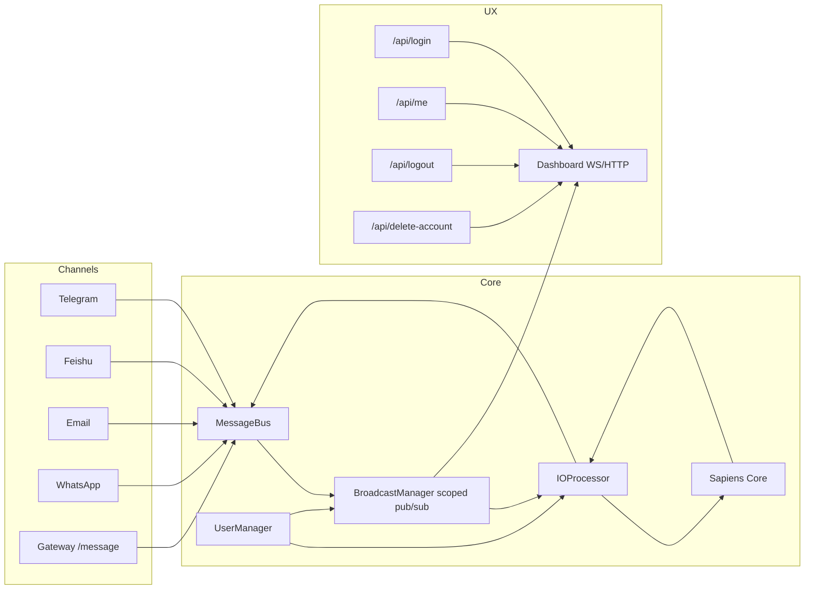

# 🦀 Crabclaw — Human-Like Multi-Channel Agent OS

<p align="center">
  <picture>
    <source media="(prefers-color-scheme: light)" srcset="Crabclaw-logo.jpg">
    
  </picture>
</p>

<p align="center">
  <a href="README.md"><strong>English</strong></a> | <a href="README.zh-CN.md"><strong>中文</strong></a>
</p>

<p align="center">
  <a href="https://pypi.org/project/crabclaw-ai/"></a>
  <a href="https://pypi.org/project/crabclaw-ai/"></a>
  <a href="https://discord.gg/MnCvHqpUGB"></a>
  <a href="LICENSE"></a>
  
</p>

Crabclaw is a lightweight but production-oriented Agent OS focused on:
- persistent cognition (HAOS/Sapiens mind model),
- multi-user isolation (user/session/memory/channel configs),
- multi-channel fanout (one user, many channels),
- observable event flow (event_id, request_id, E2E validation).

## TOC

- [What Changed](#what-changed-legacy--current)
- [Key Features](#key-features)
- [Architecture](#architecture)
- [Installation](#installation)
- [Quick Start](#quick-start)
- [Model Providers](#model-providers)
- [FAQ](#faq)
- [Troubleshooting](#troubleshooting)
- [Docker](#docker)

## What Changed (Legacy → Current)

The codebase has moved from a classic request/response chat wrapper to a scoped, event-driven architecture.

| Area | Legacy Design | Current Design |
|---|---|---|
| Core loop | Prompt-driven single loop | HAOS + Sapiens cognitive loops |
| Identity | Channel-local IDs | Unified identity mapping (`channel + external_id -> user_id`) |
| Session/memory | Mostly channel scoped | User-scoped isolation (`user_scope`) |
| Channel config | Global/static config only | Per-user channel config in portfolio |
| Event model | Queue consumer style | User-scoped pub/sub + fanout |
| Dashboard auth | Session-id oriented legacy paths | JWT token (`access_token`) + `/api/me` |
| Sync reliability | Potential loops/duplicates | Loop guard + duplicate de-dup + stable `event_id` |

## Key Features

### 1) Human-Like Cognitive Runtime
- HAOS architecture with layered cognition: physiology, psychology, sociology, axiology.
- Sapiens core receives stimuli and emits actions; I/O processor bridges channels and cognition.
- Prompt evolution and reflection hooks are built into runtime.

### 2) Multi-User Isolation by Default
- User files: `workspace/users/*.json`
- User portfolio: `workspace/portfolios/<user_id>/...`
- User session/memory isolation through `user_scope`.
- Per-user channel account configs and identity mappings.

### 3) Multi-Channel Sync and Fanout
- Inbound channel events are mapped to user scope.
- Agent replies are faned out to all mapped channels for that user.
- Origin-channel loop protection and duplicate suppression are implemented.

### 4) Operational Observability
- Scoped event stream with `event_id`/`request_id`.
- Dashboard cross-end consistency checks.
- E2E validation script:
  - `scripts/e2e_multichannel_sync_check.py`

## Architecture



Detailed docs:
- [Architecture (EN)](docs/en/architecture.md)
- [User Guide (EN)](docs/en/user-guide.md)
- [Developer Guide (EN)](docs/en/developer-guide.md)
- [架构设计 (中文)](docs/zh-CN/architecture.md)
- [用户手册 (中文)](docs/zh-CN/user-guide.md)
- [开发指南 (中文)](docs/zh-CN/developer-guide.md)
- [Glossary (EN/中文)](docs/glossary.md)

## Terminology (EN/中文)

Canonical glossary: [docs/glossary.md](docs/glossary.md)

| Term | 中文 | Meaning |
|----|----|----|
| User Scope | 用户域 | Isolation boundary for session/memory/event routing |
| Identity Mapping | 身份映射 | `(channel, external_id) -> user_id` |
| Fanout | 多通道扇出 | One reply sent to multiple mapped channels |
| Loop Guard | 回环保护 | Suppress self-echo and cyclical processing |
| Event ID | 事件ID | Stable de-dup and observability identifier |
| Request ID | 请求ID | Correlation id for one request chain |

## Installation

### Option A: Source (recommended for contributors)

```bash
git clone https://github.com/DahaiCAO/crabclaw.git
cd crabclaw
python -m venv .venv
. .venv/bin/activate   # Windows: .venv\Scripts\activate
pip install -U pip
pip install -e .
```

### Option B: PyPI

```bash
pip install crabclaw-ai
```

### Option C: uv tool

```bash
uv tool install crabclaw-ai
```

## Quick Start

### 1) Bootstrap

```bash
crabclaw onboard
```

This initializes:
- `~/.crabclaw/config.json`
- `~/.crabclaw/workspace`
- default admin account (`admin` / `admin2891`) with isolated portfolio

### 2) Configure model provider and model

```json
{
  "providers": {
    "openrouter": {
      "apiKey": "sk-or-v1-xxx"
    }
  },
  "agents": {
    "defaults": {
      "provider": "openrouter",
      "model": "anthropic/claude-opus-4-5"
    }
  }
}
```

### 3) Run services

```bash
crabclaw gateway
```

Optional dashboard:

```bash
crabclaw dashboard
```

### 4) Login to dashboard

- Open `http://127.0.0.1:18791`
- Login with default admin credentials:
  - username: `admin`
  - password: `admin2891`

## Multi-Channel and Identity Mapping

Channel enabling remains in `config.json` under `channels.*.enabled`.

New runtime behaviors:
- identity mapping binds external channel identity to one user profile,
- one inbound message can be observed on all user endpoints,
- one agent reply can fan out to all mapped channels.

## Model Providers

Crabclaw supports provider routing via `providers` + `agents.defaults`.

Built-in provider slots:
- `openrouter`, `openai`, `anthropic`, `deepseek`, `dashscope`, `gemini`,
- `moonshot`, `zhipu`, `groq`, `volcengine`, `siliconflow`, `minimax`,
- `custom`, `openai_codex`, `github_copilot`, `user_providers`.

Recommended production strategy:
1. Start with `openrouter` as unified gateway.
2. Add direct providers for critical workloads.
3. Use `llm_routes` for callpoint-level routing.

## Security Notes

- `allowFrom: []` means deny all in current design.
- To allow all senders explicitly: `allowFrom: ["*"]`.
- Prefer `tools.restrictToWorkspace: true` in production.
- Use token-based auth for dashboard (`/api/login`, `/api/me`).

More details: [SECURITY.md](SECURITY.md)

## CLI Reference (Core)

| Command | Description |
|---|---|
| `crabclaw onboard` | Init config/workspace and defaults |
| `crabclaw agent` | Interactive chat |
| `crabclaw gateway` | Start gateway service |
| `crabclaw dashboard` | Start dashboard service |
| `crabclaw status` | Print runtime status |
| `crabclaw onboard channels status` | Channel status |
| `crabclaw onboard channels login` | Channel login helpers |
| `crabclaw onboard provider login <name>` | Provider OAuth login |

## E2E Observability Script

To validate multi-end consistency, loop guard, and de-dup:

```bash
python scripts/e2e_multichannel_sync_check.py \
  --dashboard-http http://127.0.0.1:18791 \
  --dashboard-ws ws://127.0.0.1:18792/ws \
  --gateway-http http://127.0.0.1:18790 \
  --username admin \
  --password admin2891
```

The report checks:
- both clients received inbound,
- both clients received outbound,
- no duplicates,
- same outbound `event_id` set across clients.

## FAQ

### Why am I not receiving messages from a channel?
- Check `channels.<name>.enabled` is `true`.
- Check credentials/tokens are valid.
- Check `allowFrom` includes your sender ID.
- Remember `allowFrom: []` means deny all in current design.

### Why does dashboard login fail after restart?
- Re-login to obtain a fresh `access_token`.
- Verify system clock skew is not too large.
- Confirm `/api/me` works with the current token.

### Why do I see only one endpoint receiving replies?
- Ensure identity mappings are configured for the same `user_id`.
- Verify fanout targets exist in user channel config.
- Check source endpoint filtering and loop-guard behavior.

### How do I run a quick consistency test?
- Use `python scripts/e2e_multichannel_sync_check.py --help`.
- Run against your running dashboard/gateway endpoints.

## Diagnostic Command Block

```bash
crabclaw status
crabclaw onboard channels status
python -m pytest -q tests/test_multi_user_isolation.py
python scripts/e2e_multichannel_sync_check.py --help
docker compose ps
docker compose logs --tail=200 crabclaw-gateway crabclaw-dashboard
```

## Troubleshooting

### Gateway starts but no outbound delivery
1. Verify provider/model config in `~/.crabclaw/config.json`.
2. Confirm gateway and dashboard ports are reachable.
3. Check runtime logs for provider/channel exceptions.

### Dashboard loads but WS events are missing
1. Ensure dashboard WS port is open (`ws://127.0.0.1:18792/ws` by default).
2. Confirm token is present and valid.
3. Re-open browser after login to refresh WS auth context.

### Duplicate messages observed
1. Confirm events carry `event_id`.
2. Verify frontend is updated to de-dup by `event_id`.
3. Check whether multiple independent senders produced true duplicates.

### Channel replies loop back to the same source
1. Verify identity mapping is not duplicated incorrectly.
2. Check loop-guard window and outbound fingerprint logic.
3. Use the E2E script report to inspect duplicate/consistency flags.

## Docker

```bash
./scripts/docker_quickstart.sh up
./scripts/docker_quickstart.sh status
./scripts/docker_quickstart.sh logs
```

PowerShell:

```powershell
.\scripts\docker_quickstart.ps1 up
.\scripts\docker_quickstart.ps1 status
.\scripts\docker_quickstart.ps1 logs
```

## Contribution

PRs are welcome. For large architecture or behavior changes, include:
- design notes,
- test updates,
- docs updates in both English and Chinese.
