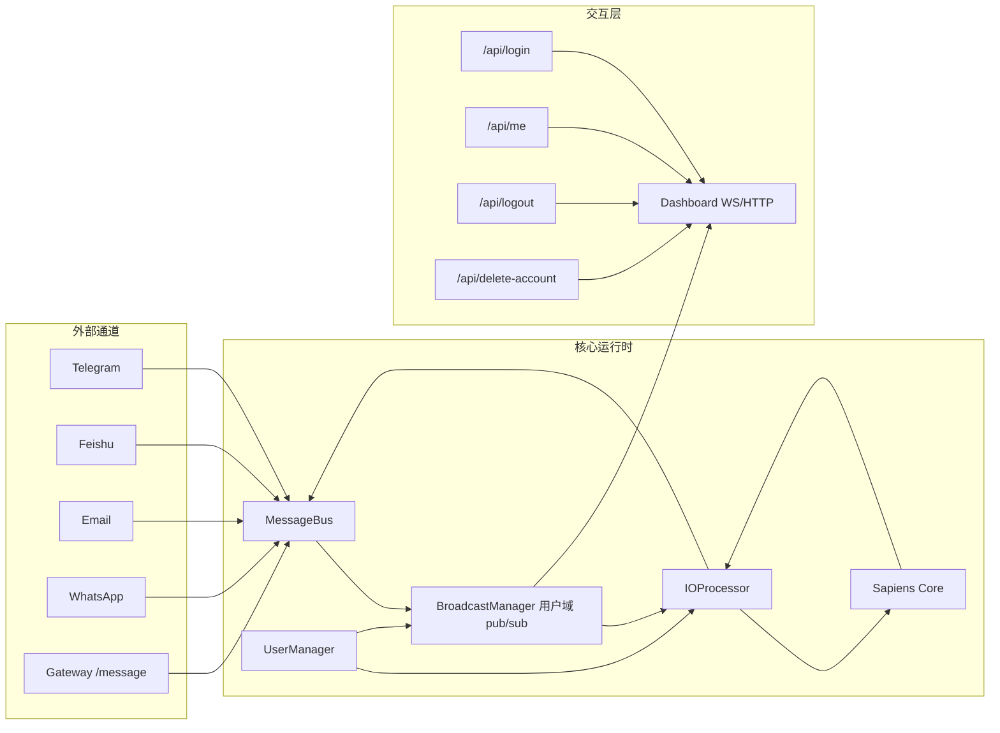

# 🦀 Crabclaw — 类人智能多通道 Agent OS

<p align="center">
  <picture>
    <source media="(prefers-color-scheme: light)" srcset="Crabclaw-logo.jpg">
    
  </picture>
</p>

<p align="center">
  <a href="README.md"><strong>English</strong></a> | <a href="README.zh-CN.md"><strong>中文</strong></a>
</p>

<p align="center">
  <a href="https://pypi.org/project/crabclaw-ai/"></a>
  <a href="https://pypi.org/project/crabclaw-ai/"></a>
  <a href="https://discord.gg/MnCvHqpUGB"></a>
  <a href="LICENSE"></a>
  
</p>

Crabclaw 是一个超级轻量但面向真实场景的 Agent 操作系统，重点能力：
- **HAOS/Sapiens 持续认知运行时**，支持后台异步思考。
- **双轨制记忆与轻量级 RAG**：全局规则与局部用户严格隔离，内置纯 Python 的 BM25 检索引擎实现动态上下文降级，彻底解决长记忆导致的 Token 爆炸。
- **多用户与多通道并发**：同一 Agent 跨 Slack、TG、钉钉、CLI 并发服务多用户（一人多端）。
- **全链路可观测**：支持 `event_id`、`request_id` 端到端事件追踪。

## TOC

- [设计演进](#设计演进旧设计--新设计)
- [Key Features](#key-features核心能力)
- [架构图](#架构图)
- [Installation](#installation安装)
- [Quick Start](#quick-start快速开始)
- [Model Providers](#model-providers模型供应商)
- [FAQ](#faq常见问题)
- [故障排查](#故障排查)
- [Docker](#docker)

## 设计演进（旧设计 → 新设计）

| 维度 | 旧设计 | 当前设计 |
|---|---|---|
| 核心形态 | 请求驱动聊天循环 | HAOS + Sapiens 认知循环 |
| 身份体系 | 通道内局部身份 | `channel + external_id -> user_id` 统一映射 |
| 会话/记忆 | 以通道上下文为主 | `user_scope` 用户域隔离 |
| 通道配置 | 全局静态配置 | 用户 portfolio 内独立配置 |
| 消息模型 | 消费式响应 | 用户域发布订阅 + 多通道扇出 |
| Dashboard 登录态 | 旧 session 路径 | JWT `access_token` + `/api/me` |
| 同步稳定性 | 易回环/重复 | 回环保护 + 去重 + 稳定事件ID |

## Key Features（核心能力）

### 1) 类人认知运行时
- 分层认知：生理、心理、社会、价值。
- Sapiens 负责认知与决策，I/O Processor 负责感知与执行。
- 反思与提示词演化可接入在线运行链路。

### 2) 多用户隔离
- 用户档案：`workspace/users/*.json`
- 用户 portfolio：`workspace/portfolios/<user_id>/...`
- 会话与记忆均支持 `user_scope`。
- 通道账号配置与身份映射按用户隔离。

### 3) 多通道同步展示
- 入站消息映射到用户域后广播。
- 智能体回复可扇出到该用户全部映射通道。
- 来源通道回环保护与重复消息抑制。

### 4) 可观测与可验证
- 事件层带 `event_id`/`request_id`。
- Dashboard 跨端一致性校验。
- 提供端到端验证脚本：
  - `scripts/e2e_multichannel_sync_check.py`

### 5) 高级记忆系统

- **双轨制隔离**：全局通用规则库与局部用户隐私档案彻底分离。
- **基于阈值的轻量 RAG**：内置零依赖纯 Python BM25 检索引擎，防止长记忆导致的 Token 爆炸。
- 支持通过 `search_deep_memory` 内部工具进行历史日志深度检索。
- 查看详细设计：[记忆系统架构设计](docs/zh-CN/memory_system.md)

## 架构与设计



详细文档：
- [架构设计（中文）](docs/zh-CN/architecture.md)
- [用户手册（中文）](docs/zh-CN/user-guide.md)
- [开发指南（中文）](docs/zh-CN/developer-guide.md)
- [Architecture (EN)](docs/en/architecture.md)
- [User Guide (EN)](docs/en/user-guide.md)
- [Developer Guide (EN)](docs/en/developer-guide.md)
- [术语表（EN/中文）](docs/glossary.md)

## 统一术语表（中英对照）

标准术语请以 [docs/glossary.md](docs/glossary.md) 为准。

| English | 中文 | 含义 |
|---|---|---|
| User Scope | 用户域 | 会话/记忆/事件路由的隔离边界 |
| Identity Mapping | 身份映射 | `(channel, external_id) -> user_id` |
| Fanout | 多通道扇出 | 一条回复发送到多个映射通道 |
| Loop Guard | 回环保护 | 抑制回声与循环处理 |
| Event ID | 事件ID | 去重与可观测的稳定标识 |
| Request ID | 请求ID | 一次请求链路关联标识 |

## Installation（安装）

### 方式 A：源码安装（推荐开发）

```bash
git clone https://github.com/DahaiCAO/crabclaw.git
cd crabclaw
python -m venv .venv
. .venv/bin/activate   # Windows: .venv\Scripts\activate
pip install -U pip
pip install -e .
```

### 方式 B：PyPI

```bash
pip install crabclaw-ai
```

### 方式 C：uv

```bash
uv tool install crabclaw-ai
```

## Quick Start（快速开始）

### 1) 初始化

```bash
crabclaw onboard
```

初始化内容：
- `~/.crabclaw/config.json`
- `~/.crabclaw/workspace`
- 默认管理员账号：`admin / admin2891`（含隔离 portfolio）

### 2) 配置模型 Provider 与模型

```json
{
  "providers": {
    "openrouter": {
      "apiKey": "sk-or-v1-xxx"
    }
  },
  "agents": {
    "defaults": {
      "provider": "openrouter",
      "model": "anthropic/claude-opus-4-5"
    }
  }
}
```

### 3) 启动服务

```bash
crabclaw gateway
```

可选启动 Dashboard：

```bash
crabclaw dashboard
```

### 4) 登录 Dashboard

- 打开：`http://127.0.0.1:18791`
- 默认管理员：
  - 用户名：`admin`
  - 密码：`admin2891`

## Multi-Channel（多通道）与身份映射

通道启用仍在 `config.json` 的 `channels.*.enabled` 中配置。

当前关键机制：
- 通道外部身份可映射到统一用户主档；
- 任一通道入站消息可在同一用户多端同步展示；
- 智能体回复可按映射扇出到多个通道。

## Model Providers（模型供应商）

内置 provider 槽位：
- `openrouter`, `openai`, `anthropic`, `deepseek`, `dashscope`, `gemini`,
- `moonshot`, `zhipu`, `groq`, `volcengine`, `siliconflow`, `minimax`,
- `custom`, `openai_codex`, `github_copilot`, `user_providers`。

推荐实践：
1. 先用 `openrouter` 作为统一网关。
2. 关键链路补充直连 provider。
3. 使用 `llm_routes` 按 callpoint 细分路由策略。

## 安全提示

- 当前设计下 `allowFrom: []` 表示拒绝所有来源。
- 如需显式放开全部来源：`allowFrom: ["*"]`。
- 生产环境建议 `tools.restrictToWorkspace: true`。
- Dashboard 建议统一走 token 登录链路（`/api/login` + `/api/me`）。

详见：[SECURITY.md](SECURITY.md)

## CLI 速查（核心）

| 命令 | 说明 |
|---|---|
| `crabclaw onboard` | 初始化配置与工作区 |
| `crabclaw agent` | 交互式对话 |
| `crabclaw gateway` | 启动网关服务 |
| `crabclaw dashboard` | 启动仪表盘服务 |
| `crabclaw status` | 查看运行状态 |
| `crabclaw onboard channels status` | 查看通道状态 |
| `crabclaw onboard channels login` | 通道登录辅助 |
| `crabclaw onboard provider login <name>` | Provider OAuth 登录 |

## 端到端一致性验证脚本

```bash
python scripts/e2e_multichannel_sync_check.py \
  --dashboard-http http://127.0.0.1:18791 \
  --dashboard-ws ws://127.0.0.1:18792/ws \
  --gateway-http http://127.0.0.1:18790 \
  --username admin \
  --password admin2891
```

检查项：
- 两个客户端都收到 inbound；
- 两个客户端都收到 outbound；
- 无重复消息；
- 两端 outbound `event_id` 一致。

## FAQ（常见问题）

### 为什么通道收不到消息？
- 检查 `channels.<name>.enabled` 是否为 `true`。
- 检查通道 token/凭据是否有效。
- 检查 `allowFrom` 是否包含你的发送者 ID。
- 注意：当前设计里 `allowFrom: []` 表示拒绝所有来源。

### 为什么 Dashboard 重启后登录失效？
- 重新登录获取新的 `access_token`。
- 检查系统时间是否偏差过大。
- 用当前 token 调用 `/api/me` 验证是否有效。

### 为什么只有一个端点收到回复？
- 检查多个外部身份是否都映射到了同一个 `user_id`。
- 检查该用户是否配置了多个有效通道账号。
- 检查来源端点过滤与回环保护是否生效。

### 如何快速做一致性验证？
- 执行 `python scripts/e2e_multichannel_sync_check.py --help`。
- 按你的运行地址传入 dashboard/gateway 参数后执行。

## 诊断命令块（可直接复制）

```bash
crabclaw status
crabclaw onboard channels status
python -m pytest -q tests/test_multi_user_isolation.py
python scripts/e2e_multichannel_sync_check.py --help
docker compose ps
docker compose logs --tail=200 crabclaw-gateway crabclaw-dashboard
```

## 故障排查

### Gateway 启动正常但没有出站发送
1. 检查 `~/.crabclaw/config.json` 中 provider/model 配置。
2. 确认 gateway/dashboard 端口可达。
3. 查看运行日志中的 provider/channel 异常。

### Dashboard 打开正常但收不到 WS 事件
1. 确认 WS 端口可访问（默认 `ws://127.0.0.1:18792/ws`）。
2. 确认 token 存在且有效。
3. 登录后刷新页面以重建 WS 认证上下文。

### 出现重复消息
1. 确认事件带有 `event_id`。
2. 确认前端版本已启用按 `event_id` 去重渲染。
3. 排查是否为多个独立发送者产生的真实重复输入。

### 回复回流到来源通道形成循环
1. 检查身份映射是否存在重复/错误绑定。
2. 检查回环保护窗口与 outbound 指纹逻辑。
3. 使用 E2E 报告中的 duplicate/consistency 字段定位问题。

## Docker

```bash
./scripts/docker_quickstart.sh up
./scripts/docker_quickstart.sh status
./scripts/docker_quickstart.sh logs
```

PowerShell：

```powershell
.\scripts\docker_quickstart.ps1 up
.\scripts\docker_quickstart.ps1 status
.\scripts\docker_quickstart.ps1 logs
```

## 贡献

欢迎 PR。若涉及架构或行为变更，请同步提交：
- 设计说明，
- 测试更新，
- 中英文文档更新。
