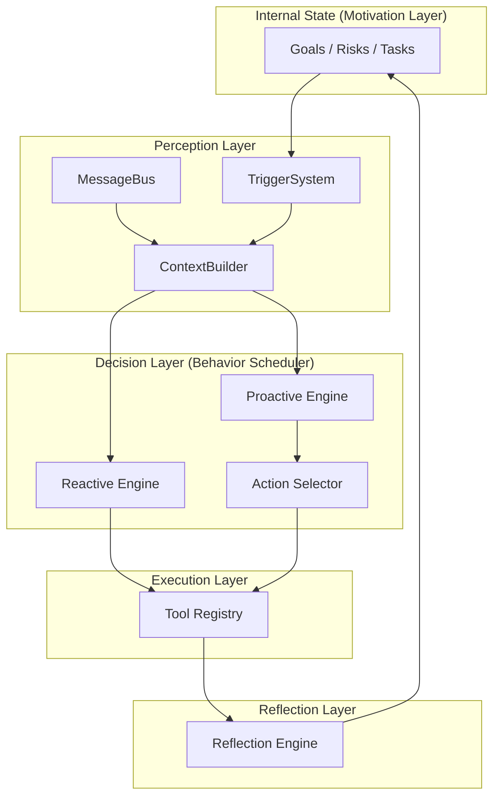

# 🦀 crabclaw — 个人 AI 助手框架
 
<p align="center">
  <picture>
    <source media="(prefers-color-scheme: light)" srcset="crabclaw_logo.png">
    
  </picture>
</p>
 
<p align="center">
  <a href="README.md"><strong>English</strong></a> | <a href="README.zh-CN.md"><strong>中文</strong></a>
</p>
 
<p align="center">
  <strong>别再堆“聊天机器人”了，开始打造你的 AI 伙伴。</strong>
</p>
 
<p align="center">
  <strong>两颗心脏，一颗大脑。</strong>
</p>

<p align="center">
  <a href="https://pypi.org/project/crabclaw-ai/"></a>
  <a href="https://pypi.org/project/crabclaw-ai/"></a>
  <a href="https://discord.gg/MnCvHqpUGB"></a>
  <a href="LICENSE"></a>
  
</p>

> 🧭 **一句话：Crabclaw 不是“LLM 包装器”，它是带“内驱力”的 Agent 操作系统。**

它基于 [Nanobot](https://github.com/HKUDS/nanobot) 和 受到[OpenClaw](https://github.com/openclaw/openclaw) 启发。

**crabclaw** 是一个超轻量、可扩展的个人 AI 助手框架。它以 **HABOS（Human-like Agent Behavior Operating System）** 为核心设计哲学：通过 **双引擎（被动 Reactive + 主动 Proactive）** 与 **内部状态（Internal State）**，让 Agent 从“被动工具”升级为“有目标、有边界、会反思”的伙伴。

⚡️ **超轻量**：核心代码量约 **~4,000 行**，读得懂、改得动、扩展快。

## 📢 更新速报

- **2026-03-09** 🚀 Beta **v0.0.1** 上线

## 🧠 HABOS：架构 2.0（双引擎 + 行为总调度器）

我们把“Agent 应该如何像人一样行动”落成了可运行的软件架构：**双引擎并行**，由一个更高层的 **Behavior Scheduler** 统一调度。

### 1) 核心：两颗心脏，同步跳动

- **🔵 被动对话引擎（Reactive Engine）**
  - **定位**：经典 ReAct 循环
  - **职责**：处理外部输入（用户消息 / 文件），快速响应、工具执行
- **🔴 主动行为引擎（Proactive Engine）**
  - **定位**：后台自主循环
  - **职责**：由内部状态驱动（目标 / 任务 / 风险 / 画像），在“价值 > 打扰成本”时触发高价值主动行为

### 2) 六层认知栈：从“感知”到“反思”

crabclaw 将 HABOS 的认知流映射到清晰的工程模块：

1. **动机层（Motivation / Soul）**：Internal State（目标、任务、风险、价值观）
2. **感知层（Perception / Nerves）**：MessageBus + TriggerSystem（外部输入与内部变化）
3. **认知层（Cognitive / Mind）**：ContextBuilder（构建“当下局势”）
4. **决策层（Decision / Brain）**：BehaviorScheduler + ActionSelector（权衡价值与打扰成本）
5. **执行层（Execution / Hands）**：ToolRegistry（调用工具与外部系统）
6. **反思层（Reflection / Conscience）**：ReflectionEngine（复盘、校准策略、写回内部状态）



## ✨ 核心亮点（为什么它更像“伙伴”）

### 1) 双引擎智能：不止会答，还会“想”
传统 agent 只有输入才醒来。crabclaw 的 **Proactive Engine** 会在后台观察内部状态：当检测到风险、机会、目标偏差时，主动提出建议或提醒，并通过“打扰成本”机制避免过度打扰。

### 2) 多步推理：让 LLM 各司其职
把复杂决策拆成多个“专用 LLM 调用”与确定性代码逻辑交织的思维链：
- **Judge**：判定是否值得行动（价值/时效/风险/打扰成本）
- **Writer**：生成最合适的表达方式
- **Editor**：发出前自检语气与安全边界

### 3) 内部状态：让 Agent 拥有“内驱力”
Internal State 让 Agent 不只是短上下文记忆，而是具备目标、任务、风险监测与用户画像的“长期意识”。

### 4) 反思引擎：自我进化闭环
反思层会评估行动效果：有没有价值？是否打扰？策略是否偏移？然后更新内部状态，让下一次更聪明、更稳。

## 📦 安装

**从源码安装**（推荐开发，拿到最新特性）

```bash
git clone https://github.com/DahaiCAO/crabclaw.git
cd crabclaw
pip install -e .
```

**使用 [uv](https://github.com/astral-sh/uv)**（稳定、极快）

```bash
uv tool install crabclaw-ai
```

**从 PyPI 安装**（稳定）

```bash
pip install crabclaw-ai
```

## 🚀 快速开始（2 分钟开聊）

> [!TIP]
> API Key 写在 `~/.crabclaw/config.json`。
> 推荐：OpenRouter（全球） · 可选：Brave Search（Web 搜索）

**1) 初始化**

```bash
crabclaw onboard
```

**2) 配置**（`~/.crabclaw/config.json`）

把下面两段合并进你的配置（其余字段都有默认值）：

*设置 API Key（例：OpenRouter）：*
```json
{
  "providers": {
    "openrouter": {
      "apiKey": "sk-or-v1-xxx"
    }
  }
}
```

*设置模型（可选指定 provider，否则自动检测）：*
```json
{
  "agents": {
    "defaults": {
      "model": "anthropic/claude-opus-4-5",
      "provider": "openrouter"
    }
  }
}
```

**3) 开聊**

```bash
crabclaw agent
```

## 💬 多通道接入（把 crabclaw 放到你常用的 App 里）

| 通道 | 你需要准备什么 |
|---------|---------------|
| **Telegram** | @BotFather 创建的 Bot Token |
| **Discord** | Bot Token + Message Content intent |
| **WhatsApp** | 扫码登录 |
| **Feishu** | App ID + App Secret |
| **Mochat** | Claw token（支持自动配置） |
| **DingTalk** | App Key + App Secret |
| **Slack** | Bot token + App-Level token |
| **Email** | IMAP/SMTP 账号 |
| **QQ** | App ID + App Secret |

> 详细配置请参考英文版 [README.md](README.md) 中每个通道的分步说明（包含 Telegram / Discord / Matrix / WhatsApp / 飞书 / QQ / 钉钉 / Slack / Email）。

## ⚙️ 配置文件

配置文件路径：`~/.crabclaw/config.json`

### Providers（模型供应商）

> [!TIP]
> - **Groq** 可提供免费的 Whisper 语音转写（配置后 Telegram 语音自动转文字）
> - 若你使用的是国内平台的特定 API Base，请在对应 provider 中配置 `apiBase`

常用 Provider 例子（完整列表请看英文版 README）：

| Provider | 说明 |
|----------|------|
| `openrouter` | 推荐：一个 key 访问几乎所有模型 |
| `anthropic` | Claude 直连 |
| `openai` | GPT 直连 |
| `deepseek` | DeepSeek 直连 |
| `dashscope` | 通义千问 |
| `moonshot` | Kimi |
| `zhipu` | 智谱 GLM |
| `custom` | 任意 OpenAI 兼容服务（直连、无 LiteLLM） |

## 🔌 MCP（Model Context Protocol）

crabclaw 支持 [MCP](https://modelcontextprotocol.io/)：接入外部工具服务器，把它们当成原生工具使用。

```json
{
  "tools": {
    "mcpServers": {
      "filesystem": {
        "command": "npx",
        "args": ["-y", "@modelcontextprotocol/server-filesystem", "/path/to/dir"]
      },
      "my-remote-mcp": {
        "url": "https://example.com/mcp/",
        "headers": {
          "Authorization": "Bearer xxxxx"
        }
      }
    }
  }
}
```

## 🛡️ 安全建议

> [!TIP]
> 生产环境建议设置 `"restrictToWorkspace": true` 来限制工具访问范围，降低越权风险。

## 🖥️ CLI 速查

| 命令 | 说明 |
|---------|-------------|
| `crabclaw onboard` | 初始化配置与 workspace |
| `crabclaw agent` | 交互式聊天 |
| `crabclaw agent -m "..."` | 单次对话 |
| `crabclaw gateway` | 启动网关（接入各聊天通道） |
| `crabclaw status` | 查看状态 |

## 🐳 Docker

```bash
docker compose run --rm crabclaw-cli onboard
vim ~/.crabclaw/config.json
docker compose up -d crabclaw-gateway
```

## 📁 项目结构

```text
crabclaw/
├── agent/          # 🧠 Agent 核心逻辑
├── skills/         # 🎯 Skills 系统（可插拔能力）
├── channels/       # 📱 多平台通道接入
├── bus/            # 🚌 消息路由
├── cron/           # ⏰ 计划任务
├── heartbeat/      # 💓 心跳唤醒
├── providers/      # 🤖 LLM Providers
├── session/        # 💬 会话管理
├── config/         # ⚙️ 配置加载与校验
└── cli/            # 🖥️ 命令行入口
```

## 🤝 贡献与路线图

欢迎 PR！项目刻意保持“可读、可改、可扩展”的小而美体积。

- [ ] 多模态（图像/语音/视频）
- [ ] 更强长期记忆
- [ ] 更强推理与反思
- [ ] 更多集成（Calendar 等）
- [ ] 更强自我改进闭环
