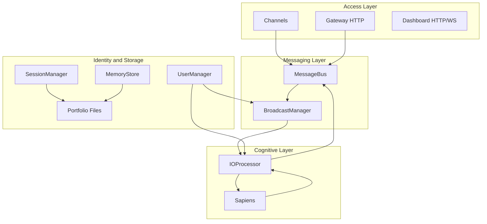
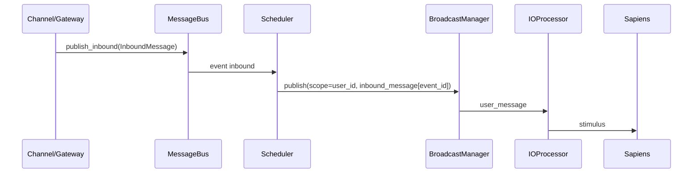
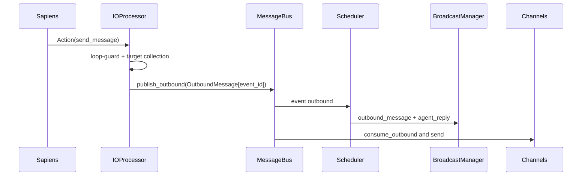

# Crabclaw Architecture (Current)

## 1. Business Scenarios

Crabclaw is designed for:
- personal AI companion with continuous cognition,
- multi-channel customer/personal assistant operations,
- one-user-many-endpoint synchronization,
- secure multi-tenant local deployment.

Typical scenario:
1. User sends message from Feishu or Telegram.
2. Message is mapped to unified `user_id`.
3. Sapiens generates reply in user scope.
4. Reply is faned out to mapped channels and synchronized to dashboard.

## 2. Layered Architecture

## 3. Key Runtime Paths

### 3.1 Inbound Path

### 3.2 Outbound/Fanout Path

## 4. Identity and Isolation Model

- Identity mapping: `identities/mappings.json`
- User profile: `users/<user_id>.json`
- User portfolio:
  - `portfolios/<user_id>/memory/`
  - `portfolios/<user_id>/history/`
  - `portfolios/<user_id>/channels/`

Isolation principles:
- session uses `user_scope`,
- memory uses `user_scope`,
- channel account config is user-owned,
- dashboard/gateway events are scoped by `user_id`.

## 5. Reliability Controls

- loop protection based on recent outbound fingerprint,
- duplicate suppression on dashboard by `event_id`,
- stable event identity across endpoints,
- request correlation by `request_id`.

## 6. Design Delta vs Legacy

- request-response only → scoped pub/sub + fanout,
- global chat context → user-isolated state,
- weak observability → event-level observability and E2E check tooling.
