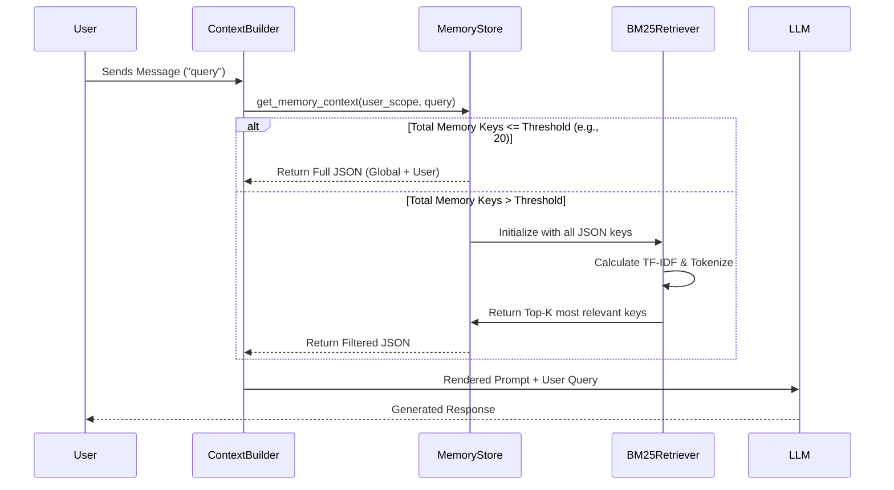
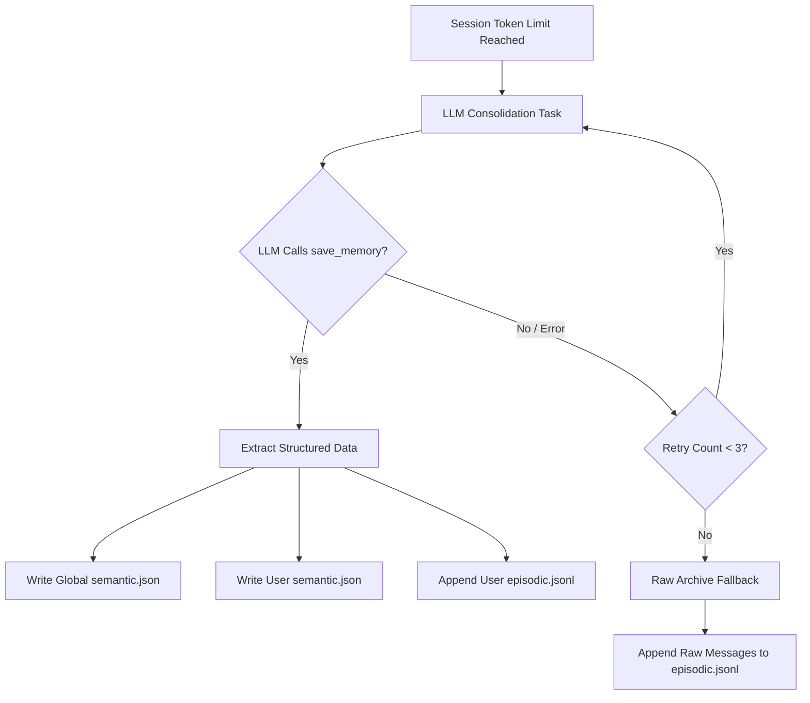

# Memory System Architecture

[中文版本](../zh-CN/memory_system.md)

Crabclaw features a highly advanced, dual-track memory system designed to solve the two biggest challenges in Agent memory management: **User Privacy Isolation** and **Infinite Context Scaling (Lost in the Middle)**.

## Core Design Philosophy

1. **Dual-Track Separation (Global vs. Local)**
   - **Global Memory**: General knowledge, coding patterns, and universal rules learned across all sessions.
   - **Local Memory (Portfolios)**: User-specific preferences, private data, and personal chat history. Completely isolated and easily purged.
2. **Template & Data Decoupling**
   - Memory is stored as structured JSON/JSONL, not raw Markdown.
   - Markdown files (`MEMORY.md`, `HISTORY.md`) act purely as **Prompt Templates** to instruct the LLM on how to interpret the structured JSON data.
3. **Threshold-Triggered RAG (Retrieval-Augmented Generation)**
   - To prevent Token explosion, semantic memory is dynamically filtered using a built-in, zero-dependency **BM25 algorithm** when the memory pool exceeds a certain threshold.

## Storage Architecture

```text
workspace/
├── memory/                              <-- 【Global Memory】
│   ├── semantic.json                    # Universal facts, rules (K-V)
│   └── episodic.jsonl                   # Global timeline events
│
├── portfolios/
│   ├── <user_id_A>/
│   │   ├── memory/                      <-- 【Local Memory】
│   │   │   ├── semantic.json            # User's private preferences
│   │   │   └── episodic.jsonl           # User's chat history summaries
│
└── templates/
    └── memory/                          <-- 【Prompt Templates】
        └── MEMORY.md                    # Injects JSON data dynamically
```

## Context Injection Flow (Threshold RAG)

When Crabclaw builds the context for an LLM call, it doesn't blindly inject all memories. It evaluates the size of the memory pool against the current user query.



## Memory Consolidation Flow

When a session reaches the memory window limit, the Agent automatically summarizes the conversation and extracts facts. It features a **Degradation/Fault-Tolerance Mechanism** to ensure zero data loss.



## Deep Exploration Tool

Instead of relying on basic `grep`, Crabclaw equips the Agent with a `search_deep_memory` tool. If the Agent realizes it needs more historical context, it can proactively use natural language to query its `episodic.jsonl` files via the internal BM25 engine.
