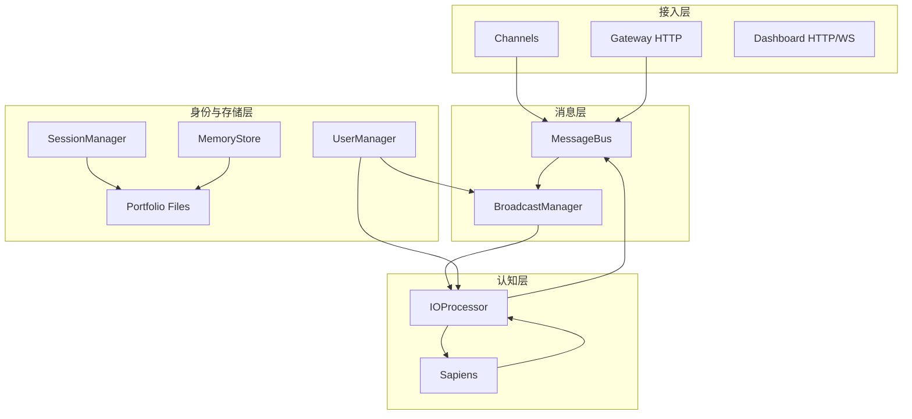
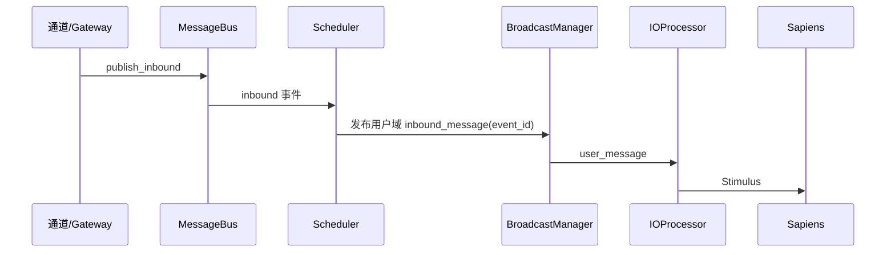
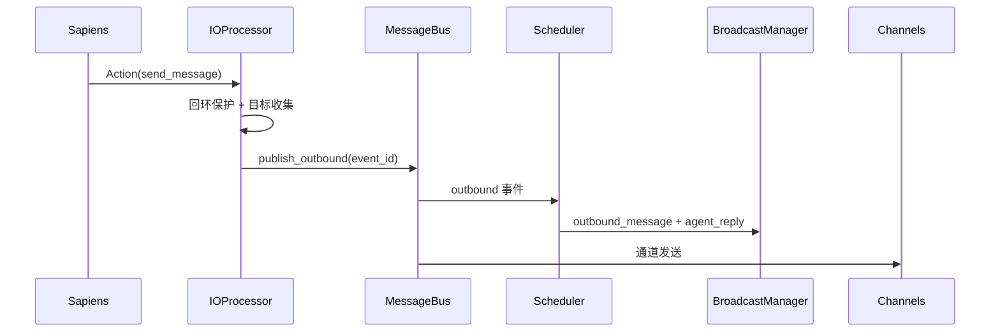

# Crabclaw 架构设计（当前版）

## 1. 业务场景

Crabclaw 主要面向：
- 个人持续智能助手，
- 多通道客户/社群运营助手，
- 一人多端同步交互，
- 本地/私有化多用户隔离部署。

典型流程：
1. 用户在飞书/Telegram 等任意通道发消息。
2. 系统将外部身份映射到统一 `user_id`。
3. Sapiens 在该用户域内完成认知与决策。
4. 回复扇出到该用户映射的多个通道，并同步到 Dashboard。

## 2. 分层架构

## 3. 核心链路

### 3.1 入站链路

### 3.2 出站与扇出链路

## 4. 身份与隔离模型

- 身份映射：`identities/mappings.json`
- 用户档案：`portfolios/<user_id>/portfolio.json`
- 用户 portfolio：
  - `portfolios/<user_id>/memory/`
  - `portfolios/<user_id>/history/`
  - `portfolios/<user_id>/channels/`

隔离原则：
- 会话按 `user_scope` 隔离；
- 记忆按 `user_scope` 隔离；
- 通道账号配置按用户隔离；
- Dashboard/Gateway 事件按 `user_id` 作用域分发。

## 5. 稳定性与可观测

- 回环保护：近期 outbound 指纹过滤 inbound 回声；
- 去重机制：前端按 `event_id` 去重渲染；
- 跨端一致：同一请求以 `request_id` 关联；
- 端到端验证：`scripts/e2e_multichannel_sync_check.py`。

## 6. 与旧设计差异

- 从消费式响应升级到用户域发布订阅；
- 从通道上下文升级到用户主档隔离；
- 从弱可观测升级到事件级可观测和自动化验证。
