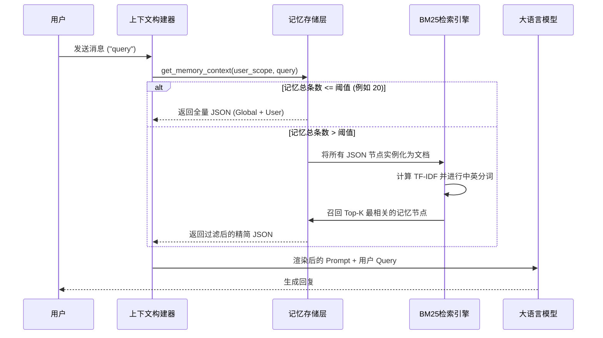
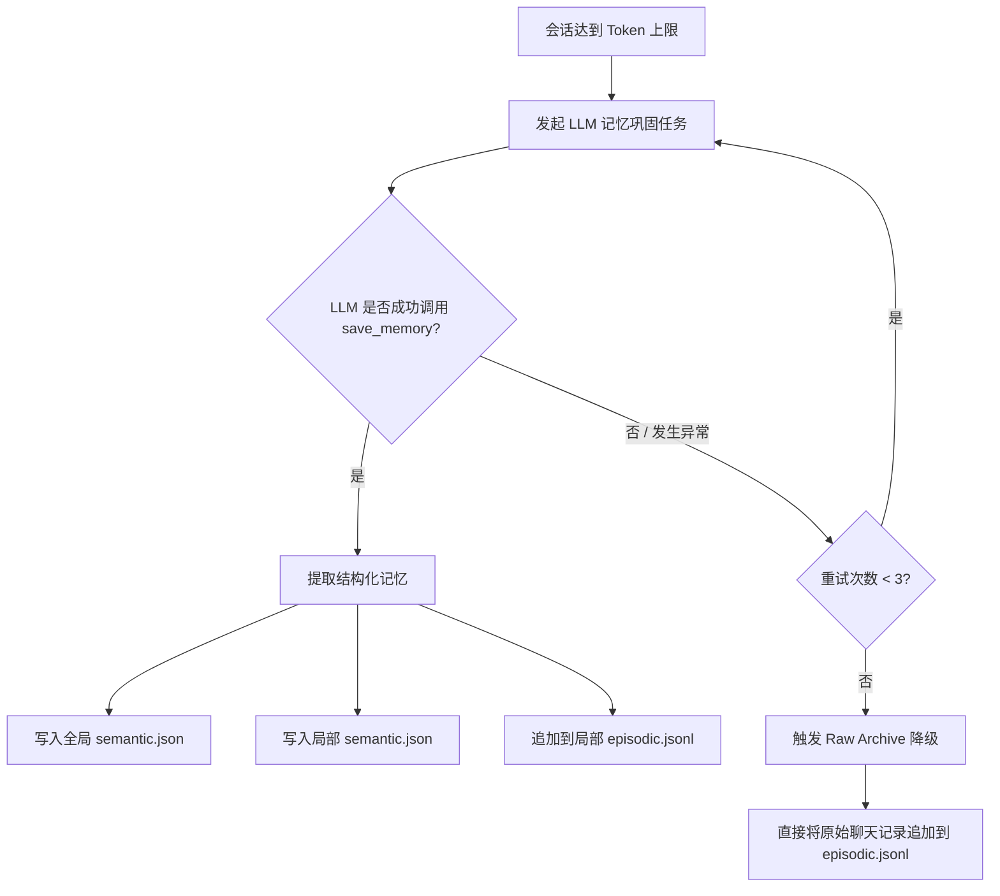

# 记忆系统架构设计

[English Version](../en/memory_system.md)

Crabclaw 拥有一个高度先进的**双轨制记忆系统**，旨在解决 Agent 记忆管理中的两大核心挑战：**多租户隐私隔离** 与 **无限上下文扩展（Lost in the Middle）**。

## 核心设计思想

1. **双轨制隔离 (全局 vs 局部)**
   - **全局记忆 (Global)**：横跨所有用户与会话学到的通用知识、代码规范、世界观规律。
   - **局部记忆 (Local/Portfolios)**：特定用户的个人偏好、隐私数据、历史聊天流水。做到绝对隔离，用户注销时可一键物理抹除。
2. **模板与数据解耦 (Decoupling)**
   - 真实的记忆数据存储为结构化的 `JSON / JSONL` 格式，不再使用纯文本。
   - Markdown 文件（如 `MEMORY.md`）纯粹作为 **Prompt 模板** 存在，用来指导大模型如何理解和使用底层的 JSON 数据结构。
3. **阈值触发式 RAG (Retrieval-Augmented Generation)**
   - 为了防止长期记忆导致 Token 爆炸，当语义记忆（Semantic Memory）超过设定阈值时，系统会自动触发一个**纯 Python、零外部依赖的内置 BM25 算法**，进行上下文的动态过滤与降级注入。

## 存储架构

```text
workspace/
├── memory/                              <-- 【全局记忆 (Global)】
│   ├── semantic.json                    # 通用事实、规则与规范 (K-V)
│   └── episodic.jsonl                   # 全局大事记日志
│
├── portfolios/
│   ├── <user_id_A>/
│   │   ├── memory/                      <-- 【局部记忆 (Local)】
│   │   │   ├── semantic.json            # 用户的私人偏好、项目状态
│   │   │   └── episodic.jsonl           # 用户的历史对话总结流水
│
└── templates/
    └── memory/                          <-- 【Prompt 提示词模板】
        └── MEMORY.md                    # 动态将 JSON 渲染注入至此
```

## 上下文注入机制 (基于阈值的轻量 RAG)

当 Crabclaw 准备发起一次 LLM 调用前，它不会盲目地把所有记忆塞进 Prompt 里，而是会根据记忆库的大小与用户当前的问题进行智能评估。



## 记忆巩固与容错降级机制

当一个会话达到滑动窗口上限时，Agent 会自动总结对话并提取长期事实。此过程引入了**降级/容错机制**，以确保数据绝对不丢失。



## 深度探索工具 (Deep Exploration)

由于流水账日志 (`episodic.jsonl`) 不会自动注入上下文，Crabclaw 为 Agent 提供了一个专属的 `search_deep_memory` 内部工具。
当 Agent 意识到自己需要更详尽的历史背景时，它可以主动使用自然语言（例如："用户之前说过的项目架构是怎样的？"）通过内置的 BM25 引擎去扫描海量的历史日志，这彻底取代了旧版本中低效的 `grep` 检索方式。
